[toc]


# To-do
- take [exam readiness](https://aws.amazon.com/training/course-descriptions/exam-workshop-solutions-architect-associate/)
- read AWS FAQ
- Jayendra's blog
- practice exams
	- A Cloud Guru (2) - *purchased*
	- John Bonso on Udemy (6) - *purchased*
	- Whizlab (7+14) - *purchased*

## schedule by day
- 11/18
	- WL-6
	- JB-6
- 11/19
	- WL-7
	- ACG-2
- 11/20
  - go through notes
  - go through Jayendra's cheat sheets

# To practice
- create your own blog (e.g. WordPress)
- create your own VPN
- create your own scraping server
	- with database backend and dashboard in frontend

# About the Exam
## Format and Logistics
- valid for **2 years**; re-certify at a discount afterwards
- **130** minutes
- **65** multiple choice questions
	- some are multiple selections
- **no penalty** for guessing
	- always guess an answer anyway
- can mark questions for later review
- identify key AWS features in the question
	- look for key phrases like "with minimum cost"

## Test Axioms
- expect single AZ to unlikely be the answer
- using AWS managed services should always be preferred
- fault tolerant and high availability are not the same
- expect everything will fail at some point and design accordingly
- if data is unstructured, S3 is usually a preferred solution
- security groups only allow; NACLs can deny
- IAM roles are preferred to access keys
- for *flexible schema*, DynamoDB is preferred
- SAML <=> SSO
- DDoS <=> AWS Shield (+ AWS WAF)
- "Orchestration"
  - Container <=> ECS
  - Serverless <=> AWS Step Function
  - Tasks <=> SWF
- IPSec <=> VPC VPN
- usually bad practice to use SQS with database for performance; use replicas, elasticache or auto scaling if possible
- WORM <=> object lock (in S3)
- FIPS 140-2 Level 2 <=> KMS
- FIPS 140-2 Level 3 <=> CloudHSM
- most AWS services use VPC *Interface* Endpoint except for S3 and DynamoDB, which use VPC *Gateway* Endpoint

## Domains
### Design Resilient Architecture (30%)
- reliable and resilient storage
	- EFS
	- EBS
	- S3
- design decoupling mechanisms
	- SQS
	- load balancer
	- elastic IP: decouple IP address from server
- multi-tier architecture solutions
- high availability and/or fault tolerant solutions
	- high availability: user can access service under any circumstance; can allow certain performance degrade
	- fault tolerance: user does not experience any issue; more strict requirement
	- RTO vs. RPO:
	  - RTO (Recovery Time Objective): how much time an application can be down without causing significant damage to the business
	  - RPO (Recovery Point Objective): the amount of data that can be lost before significant harm to the business occurs

#### HA: Highly Available architecture
- always design for failure
- use multiple AZs and regions wherever you can
- multi-AZ vs. read replicas for RDS
- scaling out vs. scaling up
	- scaling out: use auto scaling groups (add instances)
	- scaling up: increase resources inside EC2 instance (upgrade RAM or CPU)
- beware of cost element
- know different S3 storage classes
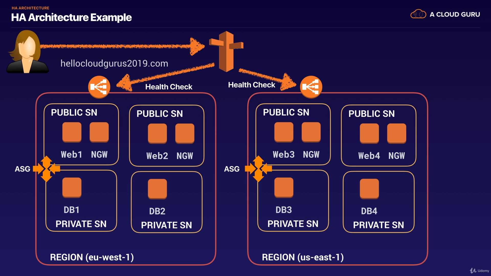
- HA bastion hosts
	- option 1: separate hosts in separate AZ; use a network load balancer with static IP address and health checks
		- cannot use application load balancer, because it is layer 7 and we need layer 4
		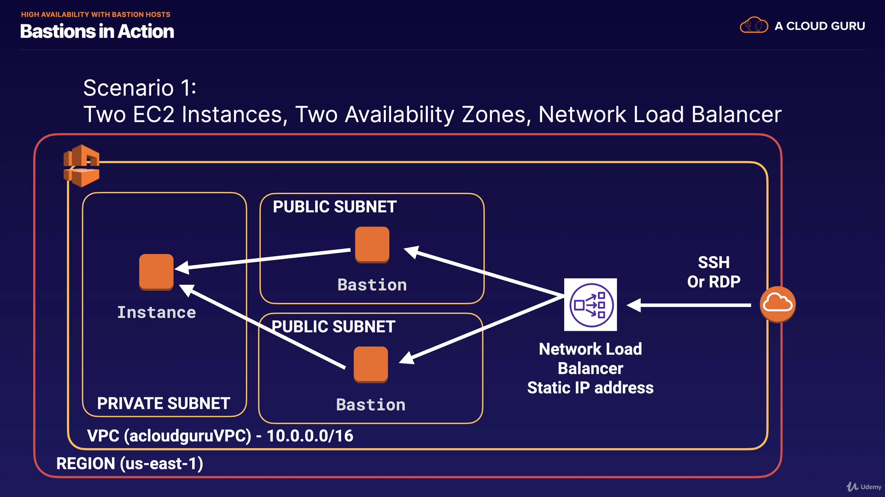
	- option 2: one host in a AZ behind an auto scaling group with health checks and a fiexed EIP. 
		- if the host fails, the health check will fail and the auto scaling group will automatically provision a new EC2 instance
		- not 100% fault tolerant; will have some downtime
		- lowest cost option
		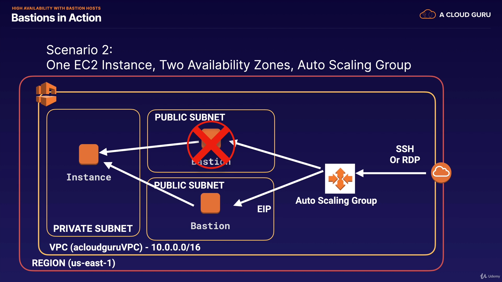

### Define Performant Solutions (28%)
- performant storage and databases
	- EBS: different types
	- S3: host static files (instead of keeping on web server)
	- RDS vs. DynamoDB vs. Redshift
	  - read replicas
- apply caching
- design solutions for elasticity and scalability

#### HPC: High Performance Computing
- data transfer: see [Jayendra's blog](https://jayendrapatil.com/aws-data-transfer-services/) for more details
	- Snowball, Snowmobile
	- DataSync
	- Direct Connect
- cache
	- CloudFront
	- API Gateway
	- ElastiCache - Memcached and Redis
	- DynamoDB Accelerator (DAX)
- compute and network
	- EC2 instances (GPU or CPU optimized)
	- EC2 fleets (e.g. spot fleets)
	- placement groups (cluster placement groups for low latency)
	- enhanced networking (ENA, VF, EFA)
- storage
	- instance-attached storage
		- EBS
		- instance store
	- network storage
		- S3: distributed object-based storage; not a file system
		- EFS: scale IOPS based on total size, or use provisioned IOPS
		- FSx for Lustre: HPC-optimized distributed file system; millions of IOPS; backed by S3
- orchestration and automation
	- AWS Batch: run many batch computation jobs
	- AWS ParallelCluster


### Specify Secure Applications and Architectures (24%)
- secure application tier
- secure data
	- in transit
		- SSL
		- VPN
		- Snowball
	- at rest
		- data on S3 is private by default and need credentials to access
- networking infrastructure for VPC
	- subnets
	- security groups and NACL
	- IGW; NAT instance/gateway
	- bastion hosts
- shared responsibility model
	- AWS responsibility: AZ, region, edge locations, EC2
- principle of least privilege

### Design Cost-optimized Architectures (18%)
- storage
- compute
- serverless architecture
- CloudFront
	- no charge for data transfer between S3 and CloudFront
- key principles
	- pay as you need
	- pay less when reserved
	- pay less per unit when use more

### Define Operationally Excellent Architectures (0%)
- prepare-operate-update
- perform operations with code
- annotate documentation
- make frequent, small, reversible changes
- refine operations procedures frequently
- anticipate failure
- related services
	- AWS Config
	- CloudFormation
	- VPC flow logs
	- CloudTrail
	- CloudWatch
	- AWS Trusted Advisor


# Topic notes

## Management

### IAM
- key entities
	- **users**
	- **groups**
	- **roles**
	- **policies** (in JSON format)
		- identity policy
		- resource policy
- universal: not specific to region
- new users have NO permissions when first created
- Access key ID and secret access keys are assigned to new users
	- not same as passwords; can only be used via APIs and command line
	- can only be viewed once
	- (for EC2) better to use **IAM roles** instead of keeping credentials
- you can give federated users single sign-on (SSO) access to AWS management console with SAML (Security Assertion Markup Language)
- Amazon Resource Name (ARN): uniquely identifies any AWS resource
	- begins with `arn:partition:service:region:account_id:`; ends with `resource` or `resource_type`
	- e.g. `arn:aws:ec2:us-east-1:1234523121:instance/*`
- IAM policy has no effect until attached
- IAM policies rules
	- not explicitly allowed means **implicitly denied**
	- explicit deny > everything else
	- AWS joins all applicable policies
	- AWS-managed vs. customer-managed
	- can control access based on tags (e.g. different access for resources tagged as prod vs. dev)
- in-line policy: only applicable to specific roles
- permission boundaries
	- used to delegate admin to other users
	- prevent privilege escalation or unnecessarily broad permissions
	- control maximum permissions an IAM policy can grant
- "owner" (in permission policy) refers to the **identity** and **email address** used to create the AWS account

### AWS Organization
- paying account should be used for billing purpose only; do not deploy resources in paying account
- enable/disable AWS services using Service Control Polices (SCP) either on OU (Organization Unit) or or individual accounts
  - SCPs affect **only IAM users and roles** that are managed by accounts that are part of the organization (including root user). SCPs don't affect resource-based policies directly. They also don't affect users or roles from accounts outside the organization
- **RAM: Resource Access Manager**
	- can share AWS resources between accounts
	  - e.g. EC2, Aurora, Route 53, resourece groups
	- sharing must be enabled with the master account
	- only resources owned by the account are shared; cannot be re-shared from other accounts
	- resource sharing can be done at an individual account basis if RAM is not enabled
- SSO helps centrally manage access to AWS accounts
	- exam tip: if you see SAML in question, look for SSO in answers


### AWS Directory Service
- a family of managed services heavily integrated with Microsoft Active Directory (AD)
- connect AWS resources with on-premise AD
- standalone directory in the cloud
- use existing corporate credentials
- enable SSO to any domain-joined EC2 instance
- provides AD domain controllers (DCs) running Windows Servers
	- reachable by applications in VPC
	- extend existing AD to on-premises using AD Trust
- **Simple AD**: standalone managed directory
	- support Windows workloads that need basic AD features
	- easer to manage EC2
	- does not support trusts
- **AD Connector**
	- directory **gateway for on-premises AD**
	- avoid caching information in the cloud
	- allow on-premise users to log in to AWS using AD
	- useful for on-premise applications
	- join EC2 instances to existing AD domain
	- scale across multiple AD connectors
- Cloud Directory
	- directory-based store for developers
	- use cases: org charts
	- fully managed service
- Cognito User Pools
	- managed user directory for SaaS applications
	- sign-up and sign-in for web or mobile
	- works with social media identities
- compatibility
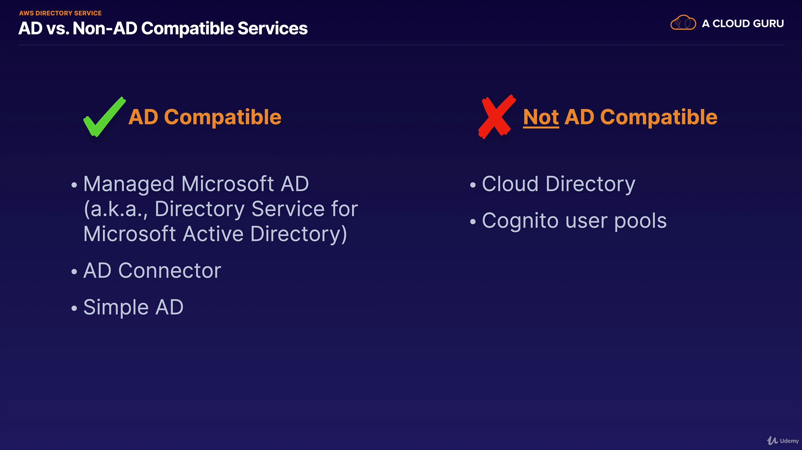


### Cognito: Web Identity Federation
- **Web Identity Federation** lets you give users access to AWS resources after they are authenticated with a web-based identity provider like Google
	- after authentication, user gets an authorization code from the web ID provider, which can be traded for temporary AWS credentials
- Cognito provides Web Identity Federation with the following features
	- sign-up and sign-in to your apps
	- access for guest users
	- acts as an Identity Broker between your application and web ID provider; no need to write additional code
	- synchronize user data for multiple devices
	- recommended for all mobile AWS services
- Cognito brokers between the app and Google/Facebook to provide temporary credentials which map to an IAM role allowing access to the required resources
- no need for the application to embed or store AWS credentials locally on the device
- used for user authentication; NOT for providing access to your AWS resources
- **user pools** are user directories used to manage sign-up and sign-in functionality
	- users can sign in directly to the User Pool or using Facebook/Google etc.
	- Cognito acts as an identity broker between the identity provider and AWS
	- successful authentication generates a JSON Web token (JWT)
- **identity pools** enabled to provide temporary AWS credentials to access AWS services like S3 or DynamoDB
	- identity pools are about authorizing access to AWS resources
	- user pools are about users (e.g. email address, passwords...)
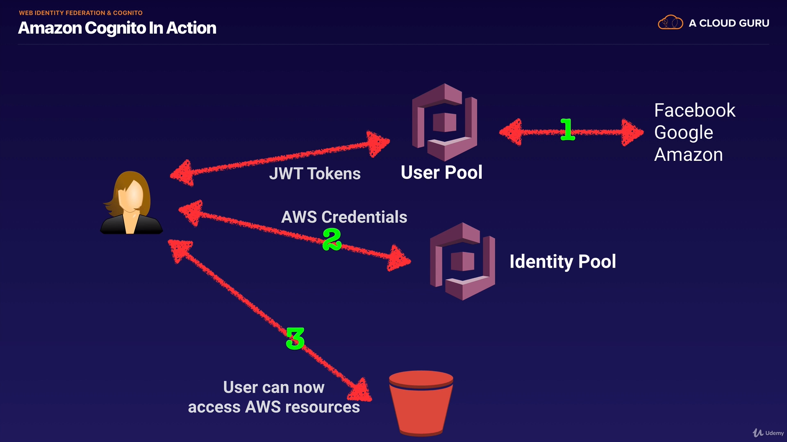
- track the association between user identity and the various different devices they sign in from
	- uses Push Synchronization to push updates and synchronize user data across multiple device
	- uses SNS to send a notification to all the devices associated with a given user identity whenever data stored in the cloud changes


### CloudWatch
- a **monitoring** service for AWS resources and applications run on AWS
  - CloudTrail: a record of your management console activities and API calls (a log of who did what at when)
- CloudWatch is for **monitoring** performance
  - e.g. CPU, disk reads, network packets, queue size
  - NOT included by default: memory, disk swap, disk space and page file utilization, log collection
  - CloudTrail is for **auditing** and tracking suspicious activities
- standard monitoring with EC2 is every **5** minutes; detailed monitoring is **1** minute
- by default, need **15** minutes to trigger the first alarm
- CloudWatch Events can monitor state changes
- CloudWatch can be used to create dashboards, set alarms, monitor events, use logs
- Using Amazon CloudWatch alarm actions, you can create alarms that automatically stop, terminate, reboot, or recover your EC2 instances
  - can take these four actions directly; no need to use AWS Config, Lambda, or any other services
- Amazon CloudWatch stores metrics for terminated Amazon EC2 instances or deleted Elastic Load Balancers for 2 weeks
- Amazon CloudWatch monitoring charge does not vary by Amazon EC2 instance type

### CloudTrail

- **log**, continuously monitor, and retain account activity related to actions across your AWS infrastructure
- You can configure CloudTrail to deliver log files from multiple regions to a single S3 bucket for a single account
- When you change an existing single-region trail to log all regions, CloudTrail logs events from all regions in your account
- In the console, by default, you create a trail that logs events in **all AWS Regions**
  - to log events in **single** region, use AWS **CLI**
- By default, CloudTrail event log files are encrypted using Amazon S3 server-side encryption (SSE)
- can use **log file integrity validation** feature to determine whether a log file was modified, deleted, or unchanged
  - SHA-256 for hashing and SHA-256 with RSA for digital signing

### AWS Config

- a service that enables you to assess, audit, and evaluate the configurations of your AWS resources
  - Evaluate your AWS resource configurations for desired settings.
  - **Get a snapshot of the current configurations** of the supported resources that are associated with your AWS account.
  - Retrieve configurations of one or more resources that exist in your account.
  - Retrieve historical configurations of one or more resources.
  - Receive a notification whenever a resource is created, modified, or deleted.
  - View relationships between resources. For example, you might want to find all resources that use a particular security group.
- continuously monitors and records your AWS resource configurations and allows you to **automate the evaluation of recorded configurations against desired configurations**
- you can review changes in configurations and relationships between AWS resources, dive into detailed resource configuration histories, and determine your overall compliance against the configurations specified in your internal guidelines
- enables you to simplify compliance auditing, security analysis, change management, and operational troubleshooting
- The AWS Config dashboard shows the **compliance status** of your rules and resources. You can verify if your resources comply with your desired configurations and learn which specific resources are noncompliant
- difference from CloudTrail: can **enforce** rules to comply with organization policy; CloudTrail is only a logging service

### Auto Scaling

- **groups**
	- logical component: webserver group, application group, or database group
	- may reference an ELB
	- health check
- **configuration templates**
	- a **launch template** or a **launch configuration** for its EC2 instances
	- basically an instruction for what instances to launch, what size they are and etc.
	- to specify information such as AMI ID, instance type, key pair, security groups
- **scaling options**
	- ways to scale groups
	- one or more may be attached to a auto scaling group
	- can scaled based on occurrence of a specified condition (dynamic scaling) - such as CPU utilization - or on a schedule
	- 5 options:
		- maintain current instance levels at all times
		- scale manually
		- simple scaling: Increase or decrease the current capacity of the group based on a single scaling adjustment
		- scheduled scaling: based on a schedule that allows you to set your own scaling schedule for predictable load changes
		- target-tracking scaling: Increase or decrease the current capacity of the group based on a target value for a specific metric
		- step scaling: Increase or decrease the current capacity of the group based on a set of scaling adjustments, known as *step adjustments*, that vary based on the size of the alarm breach
- components: auto scaling; CloudWatch; Elastic Load Balancer (optional)
- **termination logic**
	1. If there are instances in multiple Availability Zones, choose the **AZ with the most instances** and at least one instance that is not protected from scale in. If there is more than one Availability Zone with this number of instances, choose the Availability Zone with the instances that use the **oldest launch configuration**.
	2. Determine which unprotected instances in the selected Availability Zone use the oldest launch configuration. If there is one such instance, terminate it.
	3. If there are multiple instances to terminate based on the above criteria, determine which unprotected instances are **closest to the next billing hour**. (This helps you maximize the use of your EC2 instances and manage your Amazon EC2 usage costs.) If there is one such instance, terminate it.
	4. If there is more than one unprotected instance closest to the next billing hour, choose one of these instances at random.
- **lifecycle hooks**
  - The lifecycle hook puts the instance into a **wait state** (`Pending:Wait` or `Terminating:Wait`). The instance is paused until you continue or the timeout period ends
  - During this wait state, you can perform custom actitivities (e.g. retrieve operational data)
  - By default, the instance remains in a wait state for **1** hour, and then the Auto Scaling group continues the launch or terminate process
- **cool down** period
  - It ensures that the Auto Scaling group does not launch or terminate additional EC2 instances before the previous scaling activity takes effect
  - Its default value is **300** seconds
  - It is a configurable setting for your Auto Scaling group
- EC2 Auto Scaling groups are **regional** constructs. They can span Availability Zones, but not AWS regions
- When an impaired instance fails a health check, Amazon EC2 Auto Scaling automatically **terminates** it and replaces it with a new one

### General Security Risks
- bad actors: typically automated process
	- content scrapers
	- bad bots
		- fake user agent
		- Denial of Service (DoS)
- in addition to NACL where you can specify (a range of) IP address to block, you can also use host-based firewall
	- NACL operations on layer 4
- when using an Application Load Balancer, the connection from bad actor terminates at ALB, not at the EC2 instance behind
	- a host-based firewall will be ineffective in this case; still need a NACL
	- can set up a WAF before ALB
		- operates on layer 7
		- works best for SQL injection attacks, cross-site scripting attacks
		- may have a configuration of CloudFront
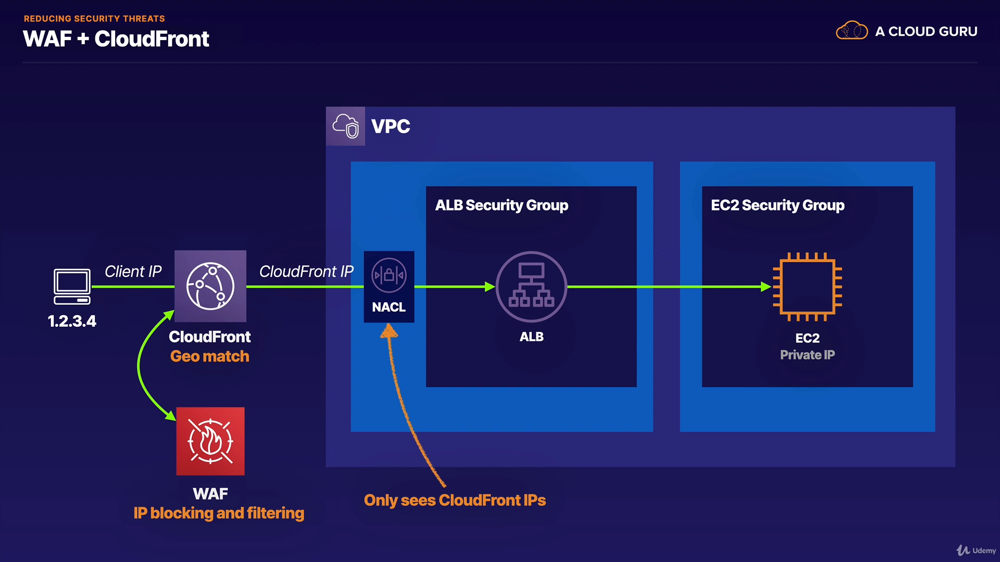
- when using a Network Load Balancer, traffic goes to EC2 instance -> only counter-measure is to use NACL

### KMS: Key Management Service
- **regional** secure key management for encryption and decryption
	- if you have an encrypted resource in one region and you want to move it to another region, must first decrypt, then move, then encrypt in new region
- manages **customer master keys (CMKs)**
	- each associated with a key policy
	- rotated periodically
	- 3 types of CMKs
	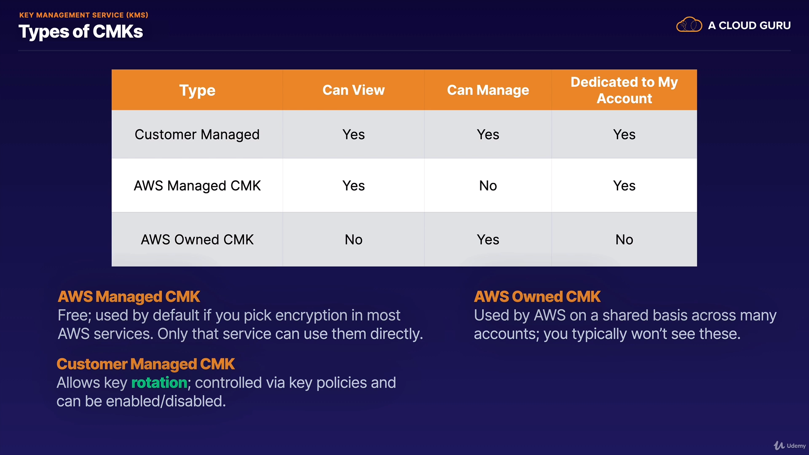
	- CMK symmetry
	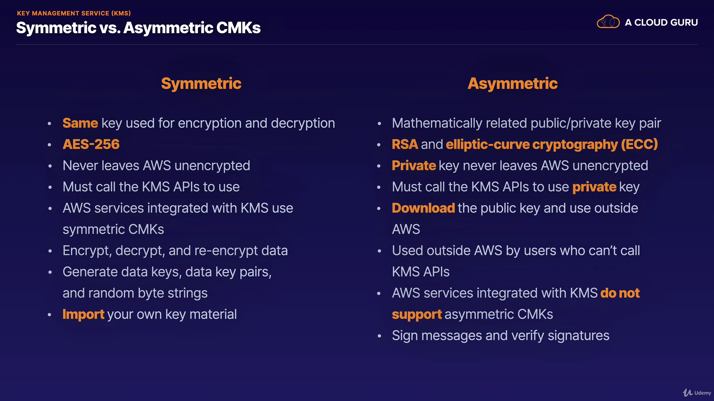
- ideal for S3 objects, database passwords and API keys
- can import your own keys, disable and re-enable keys, and define key management roles in IAM
- encrypt and decrypt data up to 4kB in size
	- can use Data Encryption Key (DEK) for larger size
- integrated with most AWS services
- pay per API call
- has audit capability using CloudTrail
- **FIPS 140-2 Level 2**
	- just need to show proof of tampering
	- CloudHSM is level 3 (more stringent)

### STS: AWS Security Token Service

- create and provide trusted users with **temporary security credentials** that can control access to your AWS resources
- Temporary security credentials work almost identically to the long-term access key credentials that your IAM users can use

### AWS Secrets Manager

- an AWS service that makes it easier for you to manage secrets
- *Secrets* can be database credentials, passwords, third-party API keys, and even arbitrary text
- can **store and control access** to these secrets centrally by using the Secrets Manager console, the Secrets Manager command line interface (CLI), or the Secrets Manager API and SDKs
- enables you to replace hardcoded credentials in your code (including passwords), with an API call to Secrets Manager to retrieve the secret programmatically
- can configure Secrets Manager to automatically rotate the secret for you according to a schedule that you specify

### CloudHSM: Hardware Security Module

- **dedicated** HSM
- **FIPS 140-2 Level 3**
- manage your own keys
- no access to the AWS-managed component
- runs within a VPC in your account
- **single tenant**, dedicated hardware, multi-AZ cluster
	- not highly available by default; need to provision HSMs across AZs
- industry-standard: no AWS APIs
- good for softwares with compliance requirement - e.g.
	- PKCS#11
	- Java Cryptography Extensions (JCE)
	- Microsoft CryptoNG (CNG)
- irretrivable if lost
  - When an HSM is zeroized, all keys, certificates, and other data on the HSM is destroyed
  - You can use your cluster's security group to prevent an unauthenticated user from zeroizing your HSM
- backups
  - When AWS CloudHSM makes a backup from the HSM, the HSM encrypts all of its data before sending it to AWS CloudHSM
  - HSM uses a unique, ephemeral encryption key known as the ephemeral backup key (EBK)
  - sent to S3 in the same region

### Parameter Store
- component of AWS Systems Manager (SSM)
- secure serverless storage for configuration and secrets
	- passwords
	- database connection strings
	- license codes
	- API keys
- values can be stored encrpyted (KMS) or plain text
- separate data from source control
- can store parameters in *hierachies*
- can track versions
- can set TTL to expire values such as passwords
- can be integrated with CloudFormation
- does NOT rotate parameters by default


## Storage

### S3: Simple Storage Service
- S3 is **object-based**
	- key (name of the object)
	- value (data)
	- version ID
	- metadata
	  - system metadata (e.g. last-modified date)
	  - user-defined metadata
	- sub-resources
		- access control lists (ACL)
		- torrent
- Object can be retrieved as a whole or partially
  - partial retrieval through **Range HTTP header**
- Files can be between **0-5TB**
- objects are **private by default**
- **unlimited** storage space
- pay as you use
- cannot install operating system on
- does not provide file system access semantics (EFS does)
- cannot tag individual folders within an S3 bucket
- Files are stored in **Buckets**
	- up to 100 buckets per account by default (maximum 1000 per account)
	- by default, all new buckets are private
	- buckets can be configured to create access logs which log all requests made to the S3 bucket
	- Bucket ownership is not transferable
	- Buckets **cannot be nested** and cannot have bucket within another bucket
	- Bucket name and region cannot be changed, once created
- S3 is a **universal** namespace (globally)
	- URL styles
		- virtual style: ```https://<bucketname>-s3-<region>.amazonaws.com/<filename>```
		- path style: ```https://s3-<region>.amazonaws.com/<bucketname>```
		- static hosting: ```https://<bucketname>-s3-website-<region>```
		- legacy global endpoint (limited support and discouraged)
	- Even though S3 is a global service, buckets are created within a region specified during the creation of the bucket
- **HTTP 200 code** returned to browser if upload to S3 is successful
- consistency model
	- **read after write (strong) consistency for PUTS of new Objects**
	- **eventual consistency for overwrite PUTS and DELETES**
- standard availability
	- **99.99%** availability by Amazon (chance of the file being available)
	- **11x9s** durability (chance of not losing the file)
- S3 features
  - **tiered storage**
  	- **standard**: cheaper for access but expensive for storage
  	- **IA** (infrequent accessed): less frequent but rapid access; cheaper for storage but expensive for access; 99.9% availability
  	- **One Zone-IA** (no multiple AZ): similar to Reduced Redundancy; good to store data that is easy to reproduce; 99.5% availability
  	  - same high durability, high throughput, and low latency as standard and IA
  	  - S3 One Zone-IA storage class is set at the object level and can exist in the same bucket as S3 Standard and S3 Standard-IA
  	- **Intelligent tiering** (by ML): standard + IA; 99.9% availability
  	- **Glacier**: retrieval time can be configured; 99.9% availability
  	  - retrieval type: standard (a few hours); expedited (1-5 minutes); bulk (5-12 hours)
  	  - Glacier Console can access the vaults and the objects in them; cannot restore them (need to use S3 console instead)
  	  - can enable provisioned retrieval capacity (with a cost): ensures that your retrieval capacity for expedited retrievals is available when you need it
  	- **Glacier Deep Archive**: retrieval time about 12 hours; minimum storage duration of 180 days; 99.9% availability
  - **lifecycle** management
  	- 2 types of behavior
  	  - Transition in which the storage class for the objects change
  	  - Expiration where the objects expire and are permanently deleted
  	- automates moving the objects between different storage tiers
  	- integrates with versioning; can be on current or previous versions
  	- Object’s lifecycle management applies to both Non Versioning and Versioning enabled buckets
  	- Lifecycle configuration on MFA-enabled buckets is not supported
  	- can apply to multipart uploads (e.g. remove such uploads if failing to complete in a specific time period).
  	- Objects must be stored **at least 30 days** in the current storage class before you can transition them to STANDARD_IA or ONEZONE_IA
  - **versioning**
  	- once enabled, cannot be disabled, only suspended
  	- integrates with lifecycle rules
  	- has MFA Delete capability: has to provide MFA auth to delete a file
  	  - only the bucket owner (root account) can enable MFA delete
  	- Permissions are set at the version level. Each version has its own object owner; an AWS account that creates the object version is the owner. You can set different permissions for different versions of the same object
  	- Versioning does NOT prevent Bucket deletion and must be backed up
  - **cross region replication**
  	- a bucket-level feature that enables automatic, asynchronous copying of objects across buckets in different AWS regions
  	- S3 can replicate all or a subset of objects with specific key name prefixes
  	- **must have versioning enabled on both source and destination buckets**
  	- when turned on, files in bucket before turning on are not automatically replicated
  	- delete markers and deletions are NOT replicated cross region
  	- S3 encrypts all data in transit across AWS regions using SSL
  	- Objects created with server-side encryption using AWS KMS–managed encryption (SSE-KMS) keys are not replicated, by default
  	- S3 does not replicate objects in the source bucket for which the bucket owner does not have permissions.
  - **encryption**
  	- encryption **in transit** is achieved by SSL/TLS (HTTPS)
  	- encryption at rest at **server** side
  		- S3 managed keys: **SSE-S3 (AES-256)**
  		- AWS key management service: **SSE-KMS** (has quota for number of requests; upload and download count towards quota; can provide audit trails)
  		- Customer provided keys: SSE-C
  	- encryption at rest at **client** side
  	  - AWS KMS-managed Customer Master Key (**CMK**)
  	  - **Client-side master key**
  	- If you need server-side encryption for all of the objects that are stored in a bucket, use a bucket policy
  	- if you chose to use server-side encryption with customer-provided encryption keys (SSE-C), you must provide encryption key information
  	  - e.g. with request header `x-amz-server-side-encryption-customer-key-MD5`
  - MFA Delete
  - Notification
    - S3 notification feature enables notifications to be triggered when certain events happen in your bucket
    - Notifications are enabled at **bucket level**
    - Notifications can be configured to be filtered by the prefix and suffix of the key name of objects. However, filtering rules cannot be defined with  overlapping prefixes, overlapping suffixes, or prefix and suffix overlapping
    - S3 can publish the following events
      - New Objects created event
      - Object Removal event
      - Reduced Redundancy Storage (RRS) object lost event
    - S3 can publish events to the following destination
      - SNS topic
      - SQS queue
      - AWS Lambda
  - S3 object lock
  	- write once, read many (**WORM**) model
  	- prevents an object from being deleted or overwritten for a fixed amount of time or indefinitely
  	- can be on single or multiple objects
  	- governance (can't overwrite or delete without permission) vs. compliance mode (can't be modified by anyone, including root user)
  	- legal hold (no retention period)
  - S3 Glacier vault lock
  	- with vault lock policy: once locked, policy cannot be changed
  - performance enhancement
  	- **prefix**: increase performance by spreading reads across prefix
  		- more prefixes, more requests you can do at the same time
  	- **multipart uploads** (required for >5G file)
  	- S3 **byte-range fetches**: download large files by parts
  	- **S3 Select**: retrieve partial data of an object by SQL
  		- S3 Select works on objects stored in CSV, JSON, or Apache Parquet format
  		- also works with objects that are compressed with GZIP or BZIP2 (for CSV and JSON objects only), and server-side encrypted objects
  		- Glacier Select also available
  - share S3 buckets across accounts (3 ways)
  	- Bucket policy & IAM (bucket level; programmatic only) - need to explicitly allow
  	- Bucket ACL & IAM (object level; programmatic only)
  	- Cross-account IAM roles (programmatic and console)
  - Pre-signed URLs
    - Pre-signed URLs allows user to be able to download or upload a specific object without requiring AWS security credentials or permissions
    - Pre-signed URL allows anyone access to the object identified in the URL, provided the creator of the URL has permissions to access that object
    - Creation of the pre-signed URLs requires the creator to provide his security credentials, specify a bucket name, an object key, an HTTP method (GET for download object & PUT of uploading objects), and expiration date and time
    - Pre-signed URLs are valid only till the expiration date & time
  - Transfer Acceleration through CloudFront
  - Website hosting
    - S3 can be used for Static Website hosting with Client side scripts
    - S3 does not support server-side scripting (e.g. JavaScript)
    - S3, in conjunction with Route 53, supports hosting a website at the root domain which can point to the S3 website endpoint
    - S3 website endpoints do not support HTTPS
    - For S3 website hosting the content should be made publicly readable which can be provided using a bucket policy or an ACL on an object
    - User can configure the index, error document as well as configure the conditional routing of on object name
    - The bucket must have the same name as your domain or subdomain
      - For example, if you want to use the subdomain `portal.tutorialsdojo.com`, the name of the bucket must be `portal.tutorialsdojo.com`.
  - Deletion
    - S3 allows deletion of a single object or multiple objects (max 1000) in a single call
    - For deleting Versioned buckets, if an object key is provided, S3 inserts a delete marker and the previous current object become non current object
    - if an object key with a version ID is provided, the object is permanently deleted
    - if the version ID is of the delete marker, the delete marker is removed and the previous non current version becomes the current version object
    - Deletion can be MFA enabled for adding extra security
  - Other operations
    - Copying of object up to 5GB can be performed using a single operation and multipart upload can be used for uploads up to 5TB
- S3 cost
	- storage (depending on tiers)
	- (number of) requests and data retrieval
	- storage management pricing
	- data transfer (out)
	- transfer acceleration (use CloudFront)
	- cross region replication
	- free:
	  - data transfer into S3
- Athena
	- interactive query service to query data in S3 with SQL
	- serverless
	- can be used to query logs, generate business reports and etc.
	- support JSON, Apache Parquet, Apache ORC
- Macie
	- ML and NLP solution to identify and protect sensitive data stored in S3
		- e.g. Personally Identifiable Information (PII)
	- continuously monitors data access activity for anomalies, and delivers alerts when it detects risk of unauthorized access or inadvertent data leaks
	- can be used to analyze logs

### Snowball
- Snowball
	- petabyte-scale data transport solution
	- **50TB** or **80TB**
	- can import to and export from S3
- Snowball Edge: **100TB** device with on-board storage and compute capabilities
	- e.g. carried in aircrafts for testing
	- portable AWS (without having to access cloud/internet)
- Snowmobile
	- Exabyte-scale data transport solution; essentially a truck

### DataSync

- copy large datasets with millions of files, without having to build custom solutions with open source tools or license and manage expensive commercial network acceleration software
- **simplifies**, **automates**, and **accelerates** copying large amounts of data to and from AWS storage services over the internet or AWS Direct Connect
- good for S3 (including Glacier and Glacier Deep Archive), EFS, FSx
- used with **NFS**- and **SMB**-compatible file systems
- replication can be done hourly, daily, or weekly
- install the DataSync agent to start the replication
- can be used to replicate EFS to EFS
- for speed, data verification can be disabled during transfer and can be enabled post transfer for data integrity

### Storage Gateway

- connects on-premise software appliance with cloud-based storage
- a virtual or physical device to replicate your on-prem data on AWS
  - The software appliance, or gateway, is deployed into your on-premises environment as a virtual machine (VM)
- 3 types of Storage Gateway
	- **File Gateway** (for flat files; stored directly on S3)
	  - network file system (NFS) & SMB
	  - "a file system mount on S3"
	- **Volume Gateway** (iSCSI)
		- **stored volume**: entire local data stored on site and asynchronously backed up to S3
		- **cached volume**: entire data stored on S3 and frequently accessed data cached on site
	- **Tape Gateway** (VTL: virtual tape library)
- Not suitable for transfering large amount of data
  - mainly used in providing **low-latency access** to data by caching frequently accessed data on-premises while storing archive data securely and durably in Amazon cloud storage services
  - optimizes data transfer to AWS by sending only changed data and compressing data
  - use DataSync to migrate large amount of data
- good for establishing a **hybrid cloud storage architecture**

### EFS: Elastic File System
- file storage system for EC2
	- Linux only; does not support Windows instance
- can be **shared** across different EC2 instances (unlike EBS)
  - Amazon EFS supports one to thousands of Amazon EC2 instances connecting to a file system concurrently
- grow and shrink automatically (unlike EBS); only pay for the storage you use
- peta-byte scale storage
- useful for distributed, highly resilient storage
	- can support thousands of concurrent NFS connections
- good for big data analytics, media processing workflows, content management, web serving, and home directories
- supports **Network File System version 4 (NFSv4) protocol**
	- one of the first network file sharing protocols native to Unix and Linux
- data is stored across multiple AZ's within a region
- read after write consistency
- **Performance mode**
  - General Purpose Performance Mode
    - ideal for latency sensitive use cases
  - Max I/O Performance Mode
    - higher levels of aggregate throughput and operations per second
    - with a tradeoff of slightly higher latency
- **Throughput mode**
  - Bursting Throughput Mode
    - throughput scales as your file system grows
  - Provisioned Throughput Mode
    - can specify file system's throughput independent of the amount of data stored
    - good for applications with high throughput-to-storage (MiB/s per TiB) ratios
- process to deploy
  - create EFS
  - create mount points in a VPC
    - EFS can only be linked to **one VPC at a time**
- lifecycle management
  - When enabled, lifecycle management migrates files that have not been accessed for a set period of time to the Infrequent Access (IA) storage class
  - After lifecycle management moves a file into the IA storage class, the file remains there indefinitely
  - Amazon EFS lifecycle management uses an internal timer to track when a file was last accessed
  - Metadata operations, such as listing the contents of a directory, don't count as file access
  - maximum days for the EFS lifecycle policy is **90** days
- encryption
  - supports encryption **at rest**; can only be done **during creation**
  - encryption in transit is not an option on EFS during or after creation
    - You can enable encryption of data in transit when you mount the file system with NFS protocol
    - in that case, EFS Mount helper uses TLS 1.2 to encrypt data in transit

### FSx
- **Windows FSx**
	- Windows Server that runs Windows SMB-based (Server Message Block) file services
	- designed for Windows and Windows applications
	- support AD users, access control lists, groups and security policies, along with Distributed File System (DFS) namespaces and replications
	- Integrated with CloudWatch to monitor storage capacity and file system activity
	- Integrated with CloudTrail to monitor all Amazon FSx API calls
	- Amazon FSx file systems is accessible from the on-premises environment using an AWS Direct Connect or AWS VPN connection
	- Amazon FSx is accessible from multiple VPCs, AWS accounts, and AWS Regions using VPC Peering connections or AWS Transit Gateway
	- Amazon FSx automatically replicates the data within an Availability Zone (AZ) to protect it from component failure
	- Amazon FSx supports Multi-AZ deployment
	- Amazon FSx supports automatic backups of the file systems, which are incremental storing only the changes after the most recent backup
	- Amazon FSx stores backups in Amazon S3
- **Lustre FSx**
	- file system optimized for **compute-intensive workloads**, such as HPC, ML,media data processing workflows, electronic data automation (EDA)
	- can store data directly on S3
	- Amazon FSx provides multiple deployment options to optimize cost
	  - **Scratch** file systems
	    - designed for temporary storage and short-term processing of data.
	    - data is not replicated and does not persist if a file server fails.
	  - **Persistent** file systems
	    - designed for long-term storage and workloads.
	    - is highly available, and data is automatically replicated within the AZ that is associated with the file system.
	    - data volumes attached to the file servers are replicated independently from the file servers to which they are attached.


## Compute

### EC2: Elastic Compute Cloud
- a web service that provides resizable compute capacity
- pricing model
	- **On demand**
	- **Reserved**: a significant discount on EC2 usage when you commit to a one-year or three-year term
		- standard reserved
		- convertible reserved (can change instance types)
		- scheduled reserved instances
	- **Spot**: bid price for instance capacity
		- if gets interrupted by AWS, instance will be **terminated** (not stopped)
		  - if Spot instance is terminated by AWS, no charge for partial hour of usage; 
		  - if you terminate the instance yourself, you will be charged for any hour in which the instance ran
		- decide max spot price; the instance will be provisioned so long as price is lower
		- can use **Spot block** to allow >max price for 1-6 hours
		- not good for persistent workload, critical jobs, and databases
		- **Spot Fleets**: a collection of Spot instances (and optionally on-demand instances)
		- Linux/UNIX, Windows Server and Red Hat Enterprise Linux (RHEL) are available. Windows Server with SQL Server is not currently available
	- **Dedicated host**
	  - when stopping and starting again, you can transition between *dedicated* and *host* mode
- For new AWS account, soft limit of 20 instances per *region*
- EC2 Fleet
  - With a single API call, EC2 Fleet lets you provision compute capacity across different instance types, Availability Zones and across On-Demand, Reserved Instances (RI) and Spot Instances purchase models to help optimize scale, performance and cost
  - Spot Fleet and EC2 Fleet offer the same functionality. There is no requirement/need to migrate
  - do NOT support multi-region EC2 Fleet
- Reserved Instance Marketplace
  - online marketplace that provides AWS customers the flexibility to sell their EC2 Reserved Instances to other businesses and organizations
- Publich IP address is not managed on the instance
  - an alias applied as a network address translation of the private IP address
- underlying Hypervisor: Xen and Nitro
- **AMI** (Amazon Machine Image) is simply a packaged-up environment that includes all the necessary bits to set up and boot your instance
  - Your AMIs are your unit of deployment
  - When migrating, AWS does NOT copy **launch permissions**, **user-defined tags**, or Amazon **S3 bucket permissions** from the source AMI to the new AMI
- AMI can be selected/configured based on
	- region
	- operating system
	- architecture (32 vs. 64 bit)
	- launch permissions
	- storage for root device
- Storage options
	- **instance store** (ephemeral storage): template stored in S3
		- can scale to millions of IOPS
		- can only be terminated or rebooted; cannot be stopped. If underlying host fails, you will lose your data
		- **once stopped, data will be lost**
		- cannot add instance store volume after provisioned; can still add EBS volume
		- fixed capacity
		- support only certain EC2 instances
		- cannot be seen under EBS Volume in the Console (because it's not EBS)
		- root volume will be deleted on termination. no option to keep root device (unlike EBS volumes)
		- an inexpensive way to launch instances where data is not stored to the root device
		- generally used for caching temporary data with fast access
	- **EBS backed volumes**
		- see next section for more details
		- scale up to 64000 IOPS
		- attachable storage linked with EC2 instance one at a time
		  - but one instance to one EBS volume (not multiple)
		- supports encryption and snapshots
		- By using Amazon EBS, data on the root device will persist independently from the lifetime of the instance.
- encryption (of root device)
	- EBS root volumes of your default AMI's can be encrypted (unlike before); additional volumes can be encrypted
	- to encrypt a volume after provisioned, create a snapshot, make a copy, and encrypt the copied snapshot, create AMI based on it, launch instance from AMI
	- snapshots must be unencrypted to be shared
- **instance types**
	- Accelerated Computing instance family is a family of instances which use hardware accelerators, or co-processors, to perform some functions, such as floating-point number calculation and graphics processing, more efficiently than is possible in software running on CPUs
- **security groups**
	- specify inbound and outbound rules
	- rule change takes effect **immediately**
	- security groups are **stateful**: if you open a port, it will be open for both inbound and outbound
		- unlike ACL which is stateless
		- if you create inbound rule for HTTP, same outbound rule is automatically created
	- **all inbound traffic is blocked by default**; all outbound traffic is allowed
	- cannot block particular port, type or IP address; can specify allow rule but not deny rules
	- can have multiple security groups attached to one EC2
	- can have multiple EC2 instances with the same security group
	- **security group can talk to each other**: e.g. set up inbound rule to allow traffic from another security group
- network options
	- **ENI** (Elastic Network Interface)
		- essentially a virtual network card
		- allows IPv4 addresses from the range of your VPC; with security groups, MAC address and etc.
		- use case: basic networking; create a management network; use network and security appliances in your VPC; create dual-homed instances
		- When an ENI is moved from one instance to another, network traffic is redirected to the new instance
		- Multiple ENIs can be attached to an instance (e.g. for low-budget, high-available solution; to create management network; create dual-homed instances with workloads on distinct subnets)
		- attach a network interface to an EC2 instance in the following ways
		  - When it's running (hot attach)
		  - When it's stopped (warm attach)
		  - When the instance is being launched (cold attach)
	- EN (Enhanced Networking)
		- use single root I/O virtualization to provide high-performance networking capabilities; provides higher bandwidth, higher packet per second (PPS)
		- use case: when you want good network performance (speed up to between 10-100Gbps)
		- can be enabled via Elastic Network Adapter (**ENA**) for up to 100Gbps or Virtual Function (VF) for up to 10 Gbps (usually go with ENA)
	- **EFA** (Elastic Fabric Adapter)
		- a network device you can attach to EC2 instance to accelerate High Performance Computing (**HPC**) and **ML** applications
		- can use OS-bypass: enable HPC and ML applications to bypass operating system kernel and to communicate directly with EFA device. **Linux only**
		- EFA support can be enabled either at the launch of the instance or added to a stopped instance. EFA devices cannot be attached to a running instance
		- use case: HPC and ML applications; OS-bypass
		- Examples of HPC applications include computational fluid dynamics (CFD), crash simulations, and weather simulations
- **hibernation**
	- saves the contents from the instance memory (RAM) to EBS root volume
		- instance RAM must be less than 150GB
		- cannot be enabled if there is only instance store volume
		- If the EBS root volume does not enough space, hibernation will fail and the instance will get shutdown instead
	- operating system performs hibernation (suspend-to-disk); not rebooted
	- instance boots much faster. good for long-running processes and services that take time to initialize
	- **previously attained data volumes are reattached**; instance ID remains the same (unlike stop-restart)
	  - only public IPv4 address is released and re-assigned upon restart; private IPv4 and any IPv6 addresses are retained
	- needs to **enable** hibernation when provisioning the instance; root volume must be encrypted
	- can't be hibernated for more than 60 days
	- available for on-demand and reserved instances
	- not supported with EC2 instances in an auto scaling group
	- Hibernating instances are charged at standard EBS rates for storage. As with a stopped instance, you do not incur instance usage fees while an instance is hibernating
	- when in hibernation, pricing is calculated based on the following
	  - elastic IP address
	  - EBS volume attached to EC2 instance
	  - (no charge for compute capacity)
- **placement group**
	- **clustered**
		- grouping of instances within a **single AZ** (cannot span multiple AZ's)
		- low network latency, high network throughput
		- recommend to have homogeneous instances within clustered placement groups
	- **spread**
		- a group of instances that are each placed on distinct underlying hardware
		- recommended for applications that have a small number of **critical** instances that should be kept separate from each other
		- up to 7 running instances per AZ
	- **partitioned**
		- each partition has its **own rack**, network and power sources
		- each partition can have multiple instances, but each partition is separate from each other
	- other features
		- unique placement group name within AWS account
		- cannot merge placement groups
		- only certain types of instances can be launched in a placement group (Compute Optimized, GPU, Memory Optimized, Storage Optimized)
		- existing instance can be moved to a placement group; needs to be stopped first; cannot be moved via console yet
- VM Import/Export
  - enables customers to import Virtual Machine (VM) images in order to create Amazon EC2 instances
  - Customers can also export previously imported EC2 instances to create VMs
  - VMDK is a file format that specifies a virtual machine hard disk encapsulated within a single file
  - The virtual machine must be in a stopped state before generating the VMDK or VHD image
- metadata
	- information about the instance itself (e.g. public and private IPv4 address)
	- can be retrieved via a special URL (```http://169.254.169.254```) or using the API via CLI or an SDK
	- can assign your own metadata in the form of tags
- billing and instance status
  - `pending` - The instance is preparing to enter the running state. An instance enters the pending state when it launches for the first time, or when it is restarted after being in the stopped state. You will not be billed in this state
  - `running` - The instance is running and ready for use. You are billed in this state
  - `stopping` - The instance is preparing to be stopped. Take note that you will not billed if it is preparing to stop however, you will **still be billed** if it is just preparing to hibernate
  - `stopped` - The instance is shut down and cannot be used. The instance can be restarted at any time
  - `shutting-down` - The instance is preparing to be terminated
  - `terminated` - The instance has been permanently deleted and cannot be restarted. Take note that Reserved Instances that applied to terminated instances are **still billed** until the end of their term according to their payment option
- management and configuration
  - AWS Systems Manager **Run Command** lets you remotely and securely manage the configuration of your managed instances (without having to login to each instance)
    - automate common administrative tasks and perform ad hoc configuration changes at scale
- Troubleshoot: you might be unable to log into an EC2 instance if
  - You're using an SSH private key but the corresponding public key is not in the authorized_keys file.
  - You don't have permissions for your authorized_keys file.
  - You don't have permissions for the .ssh folder.
  - Your authorized_keys file or .ssh folder isn't named correctly.
  - Your authorized_keys file or .ssh folder was deleted.
  - Your instance was launched without a key, or it was launched with an incorrect key

### EBS: Elastic Block Store
- provides persistent **block storage** volumes for use with EC2 instances (essentially virtual hard disk drive)
  - block storage: can change single bytes of data
  - in contrast, S3 (and Glacier) is object-based storage, where you much update the whole object each time
- automatically replicated within **AZ**
- termination protection is turned off by default
- provides **lowest-latency** access to data from a single EC2 instance (comparing to EFS and S3)
- on an EBS-backed instance, the default action is for the root EBS volume to be deleted when the instance is terminated
	- additional volumes will remain (by default)
- types
  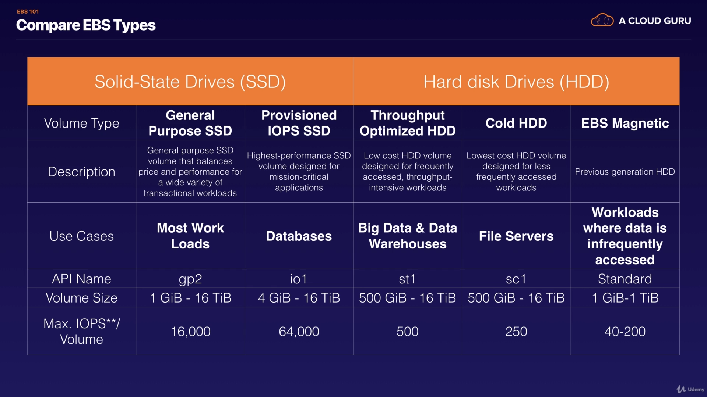
  - SSD-backed storage for **transactional** workloads (performance depends primarily on IOPS) and HDD-backed storage for **throughput** workloads (performance depends primarily on throughput, measured in MB/s)
    - **SSD-backed** volumes are designed for transactional, IOPS-intensive database workloads, boot volumes, and workloads that require high IOPS; good for **random** access
    - **HDD-backed (magnetic)** volumes are designed for throughput-intensive and big-data workloads, large I/O sizes, and sequential I/O patterns; good for **sequential** access; lower IOPS; always cheaper than SSD
- EBS volume needs to be in the **same AZ as EC2**
- EBS volume can be attached to multiple EC2 instances
- volume can be changed (type and size) after EC2 is provisioned; may take some time to take place
- to move to different AZ, create a snapshot; then create an image (AMI) based on the snapshot (with hardware-assisted virtualization); launch EC2 from AMI in another AZ or copy AMI to another region
- additional EBS volume (not root device) can be detached without stopping the instance
  - best to unmount the volume from the instance first
- **Snapshots**
  - EBS volumes can be backed up by creating a snapshot of the volume, which is stored in S3
  - EBS snapshots are only available through the Amazon EC2 APIs (not S3 APIs)
  - snapshots are **incremental**; only the blocks that have changed are captured in latest snapshots
    - the snapshot deletion process is designed so that you need to retain only the most recent snapshot in order to restore the volume
    - latest snapshot is both incremental and complete; just need to maintain latest snapshot
  - best to take snapshots when instance is stopped (can still take snapshot if running)
  - EBS Snapshots can be used to migrate or create EBS Volumes in different AZs or regions
  - Snapshots are **constrained to the region** in which they are created and can be used to launch EBS volumes within the same region only
  - Snapshots can be shared by making them public or with specific AWS accounts by modifying the access permissions of the snapshots
  - Encrypted snapshots cannot be made available publicly
  - EBS snapshots fully support EBS encryption
  - Snapshots of encrypted volumes are automatically encrypted
  - Volumes created from encrypted snapshots are automatically encrypted
  - You can use Amazon **Data Lifecycle Manager** (Amazon DLM) to automate the creation, retention, and deletion of **snapshots** taken to back up your Amazon EBS volumes
- **Encryption**
  - Encryption occurs on the servers that host EC2 instances, providing encryption of data-in-transit from EC2 instances to EBS storage.
  - EBS encryption is supported with all EBS **volume** types (gp2, io1, st1 and sc1), and has the same IOPS performance on encrypted volumes as with unencrypted volumes, with a minimal effect on latency
  - EBS encryption is only available on **select instance** types
  - Snapshots of encrypted volumes and volumes created from encrypted snapshots are **automatically encrypted** using the same volume encryption key
  - EBS encryption uses AWS Key Management Service (AWS KMS) customer master keys (CMK) when creating encrypted volumes and any snapshots created from the encrypted volumes.
  - EBS volumes can be encrypted using either
    - a default CMK is created for you automatically.
    - a CMK that you created separately using AWS KMS, giving you more flexibility, including the ability to create, rotate, disable, define access controls, and audit the encryption keys used to protect your data.
  - Public or shared snapshots of encrypted volumes are not supported, because other accounts would be able to decrypt your data and needs to be migrated to an unencrypted status before sharing.
  - Encrypted snapshot can be created from a unencrypted snapshot by create an encrypted copy of the unencrypted snapshot
  - Unencrypted volume cannot be created from an encrypted volume directly but needs to be migrated


### Lambda
- takes care of provisioning and managing the servers to run your **stateless** code
- makes it easy to execute code **in response to events**, such as changes to Amazon S3 buckets, updates to an Amazon DynamoDB table, or custom events generated by your applications or devices
- use cases
	- event-driven compute service where Lambda runs your code in response to events (e.g. data change in S3 bucket)
	- run code in response to HTTP requests using API Gateway or API calls
- use Lambda to directly interact with backend database (and skip EC2 instances where you need to manage all the configurations)
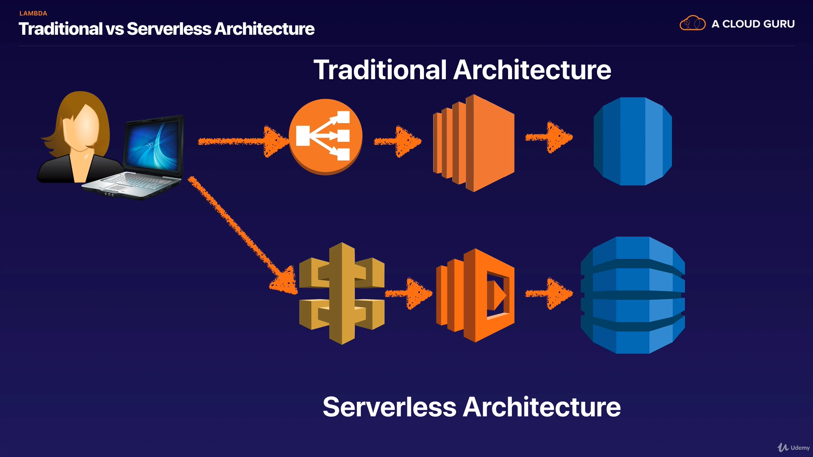
- continuously **scaling out** (automatically)
	- **each event triggers an individual Lambda function**
- **Lambda functions can trigger Lambda functions**
- priced based on:
	- **number of requests**: first 1 million requests are free; $0.2 per 1 million requests thereafter
	- **duration**: rounded up to 100ms; also depends on **memory** allocated - e.g. $0.00001667 per GB-second
- AWS **X-ray** allows you to debug serverless applications (as architecture can get complex)
- Lambda can do things **globally** (e.g. back up S3 buckets to another S3 bucket)
- **Lambda@Edge**
  - a feature of Amazon CloudFront that lets you **run code closer to users of your application**, which improves performance and reduces latency
  - a scalable solution to **segregate different types of users** accessing web applications
  - By using Lambda@Edge and Kinesis together, you can process real-time streaming data so that you can track and analyze globally-distributed user activity on your website and mobile applications, including clickstream analysis
- possible [triggers](https://docs.aws.amazon.com/lambda/latest/dg/lambda-services.html)
	- API Gateway
	- CloudWatch events
	- Elastic Load Balancer
	- DynamoDB
	- Kinesis
	- SNS
	- SQS
	- MQ
	- Cognito
	- CloudFront
	- ...
- RDS can NOT trigger Lambda
- Lambda supports hyper-threading on one or more virtual CPUs
- can use CloudWatch logs for accessing many Lambda results (e.g. print statement) and logs
- encryption
  - When you create or update Lambda functions that use environment variables, AWS Lambda encrypts them using the AWS Key Management Service (KMS)
  - if you wish to use encryption helpers and use KMS to encrypt environment variables after your Lambda function is created, you must create your own AWS KMS key and choose it instead of the default key

### Elastic Beanstalk

- can quickly deploy and manage applications in AWS **without managing the infrastructure**
  - no knowledge of AWS needed; can just upload application code and let AWS set up everything
- create Web Server environments and Worker environments
- automatically handles capacity provisioning, load balancing, scaling, health monitoring
- you can modify settings (e.g. add auto scaling) after provision
- can deploy applications based on a single Dockerfile (i.e. container-based application)


## Network

### CloudFront
- content delivery network (CDN)
- see [Jayendra's blog](https://jayendrapatil.com/aws-cloudfront/) for more details
- components
  - **edge location**: the location where content is cached
  	- not read only; can write to edge locations too
  	- objects are cached for the life of the TTL (time to live)
  	- you can clear cached objects (invalidation), but you will be charged
  - **origin**: origin of all the files to be distributed. Can be S3, EC2 instance, Elastic Load Balancer, or Route53...
  - **distribution**: a collection of edge locations given to CDN
- web distribution vs. RTMP (for media streaming)
- benefit: use AWS backbone network, instead of traversing internet
- does NOT have the capability to route the traffic to the closest edge location via an **Anycast static IP address**
  - Global Accelerator can
- Restricted access
	- CloudFront **signed URLs**: 1 file for 1 URLs
	- CloudFront **signed cookie**: 1 cookie for multiple files
	  - does not support Real-Time Messaging Protocol (RTMP) distribution 
	- policy attached when signed URL or cookie is created
		- URL expiration
		- IP range
		- trusted signers
	- use CloudFront signed URL/cookie for EC2 and etc. 
		- S3 signed URL is an alternative for S3 only
	- **S3 signed URL**
		- issues a request as the IAM user who creates the pre-signed URL
		- limited lifetime
		- only if the user can access S3 directly (not usually the case)
		- use RTMP distribution (not supported by signed cookie)
		- Signed URLs are used to restrict access to files in CloudFront edge caches; it cannot prevent users from fetching files directly through S3 URLs
	- if you need to restrict access so that users cannot view the files directly by using the S3 URLs, you can create **origin access identity (OAI)** and associate it with the distribution

### WAF: Web Application Firewall
- monitor **HTTP** and **HTTPS** requests
- **layer-7** aware firewall: specific to application
- 3 types of behaviors:
	- allow all requests except the ones you specify
	- block all requests except the ones you specify
	- count the requests that match the properties you specify
- protection against web attacks with the following possible conditions:
	- IP address (IP match)
	- country
	- values in request headers
	- strings that appear in requests (string match)
	- length of requests (size constraint)
	- malicious SQL code (SQL injection)
	- malicious script (cross-site scripting)

### AWS Shield

- a managed Distributed Denial of Service (**DDoS**) protection service
- network and transport layer protections
- provides always-on detection and automatic inline mitigations that minimize application downtime and latency, so there is no need to engage AWS Support to benefit from DDoS protection
- two tiers of AWS Shield: Standard and Advanced
- All AWS customers benefit from the automatic protections of AWS Shield Standard, at no additional charge
- AWS WAF alone is not enough to fully protect your VPC from DDoS. You still need to use AWS Shield in combination

### Route 53: DNS

- convert human friendly domain names to Internet Protocol (IP) address
- IPv4 (32 bits) addresses are running out, hence IPv6 (128 bits)
- top level (.com) and second level domain (.uk)
- top domain names are controlled by by the Internet Assigned Numbers Authority (IANA) in a root zone database
	- IANA [database](http://www.iana.org/domains/root/db)
- domain registrar: an authority to assign domain names
	- e.g. Amazon, GoDaddy.com
	- may take 3 days to register (with Amazon)
- Start of Authority (SoA): every DNS begins with this
	- name of the server that supplied the data for the zone
	- administrator of the zone
	- current version of the data file
	- default number of seconds for the time-to-live file on resource records (usually 48 hours)
- **Name Server (NS)** records: used by top level domain servers to direct traffic to the content DNS server
- **A Record** (A=Address): translates domain name to numerical IP address
	- e.g. `http://www.acloud.guru` to `http://123.10.10.80`
- Use AAAA record to enable IPv6 resolution
- **CNAME** (Canonical Name): resolve one domain name to another
	- e.g. `m.acloud.guru` and `mobile.acloud.guru` mapped to same IP
	- cannot be used for naked domain names (e.g. cannot work for `http://acloud.guru`)
	- If a CNAME record is created for a subdomain, any other resource record sets for that subdomain cannot be created
- **Alias Records**: map resource record sets to load balancers, CloudFront distributions or S3 (configured as websites)
	- like CNAME; but can create an alias record both for the **root domain** or **apex zone** and for subdomains
	- always choose Alias Record over CNAME
- **Hosted Zone**
  - Hosted Zone is a container for records, which include information about how to route traffic for a domain and all of its subdomains.
  - A hosted zone has the same name as the corresponding domain.
  - Routing Traffic to the Resources
    - Create a hosted zone with either a public hosted zone or a private hosted zone:
      - Public Hosted Zone – for routing internet traffic to your resources for a specific domain and its subdomains
      - Private hosted zone – for routing traffic within an VPC
    - Create records in the hosted zone
      - Records define where to route traffic for each domain name or subdomain name.
      - name of each record in a hosted zone must end with the name of the hosted zone.
- Elastic Load Balancer (ELB) does NOT have pre-defined IPv4 addresses; resolve to them using a DNS name
- use Route 53 health checking to configure **failover** configurations
  - **active-active** failover
    - any routing policy (or combination of routing policies)
    - if you want all of your resources to be available the majority of the time
    - all the records that have the same name, the same type (such as A or AAAA), and the same routing policy (such as weighted or latency) are active unless Route 53 considers them unhealthy
    - no distinction of primary/secondary resource
  - **active-passive** failover
    - failover routing policy only
    - if you want a primary resource or group of resources to be available the majority of the time and you want a secondary resource or group of resources to be on standby in case all the primary resources become unavailable
    - When responding to queries, Route 53 includes only the healthy primary resources
- **Routing Policy**
	- **simple routing**
		- one record with multiple IP addresses
		- if multiple values specified in record, Route 53 returns all values in a random order
	- **weighted routing**
		- split traffic based on weights assigned
		- Weights can be assigned any number from **0 to 255**
		- good for testing new (different) versions of applications (e.g. blue-green deployment)
	- **latency-based routing**
		- route traffic based on lowest network latency for end user
		- Latency between hosts on the Internet can change over time as a result of changes in network connectivity and routing. Latency-based routing is based on latency measurements performed over a period of time, and the measurements reflect these changes
	- **failover routing**
		- for active/passive (primary/secondary) setup
		- if active record set fails health check, traffic is directed to passive record set
		- applicable for Public hosted zones only
	- **geolocation routing**
		- send traffic based on geographic location of the end user
		- for overlapping geographic regions, priority goes to the smallest geographic region
	- **geoproximity routing** (traffic flow only)
		- route traffic based on geographic location of user and resource
		- can also use bias to assign traffic -> expands or shrinks the size of a geographic region
		- must use Route 53 traffic flow
	- **multivalue answer routing**
		- like simple routing and allows to put health check on each record set
- can set **health checks** on individual record sets; if fails, will be removed from Route 53 until it passes the check
- **Elastic IP address**
  - By default, all accounts are limited to **5** Elastic IP addresses per region
  - You do not need an Elastic IP address for all your instances
  - The public address of your EC2 instance is associated exclusively with the instance until it is stopped, terminated or replaced with an Elastic IP address

### VPC: Virtual Private Cloud
- provision a logically isolated section of AWS cloud
- consists of IGWs (or Virtual Private Gateways), Route Tables, Network Access Control Lists, Subnets, and Security Groups
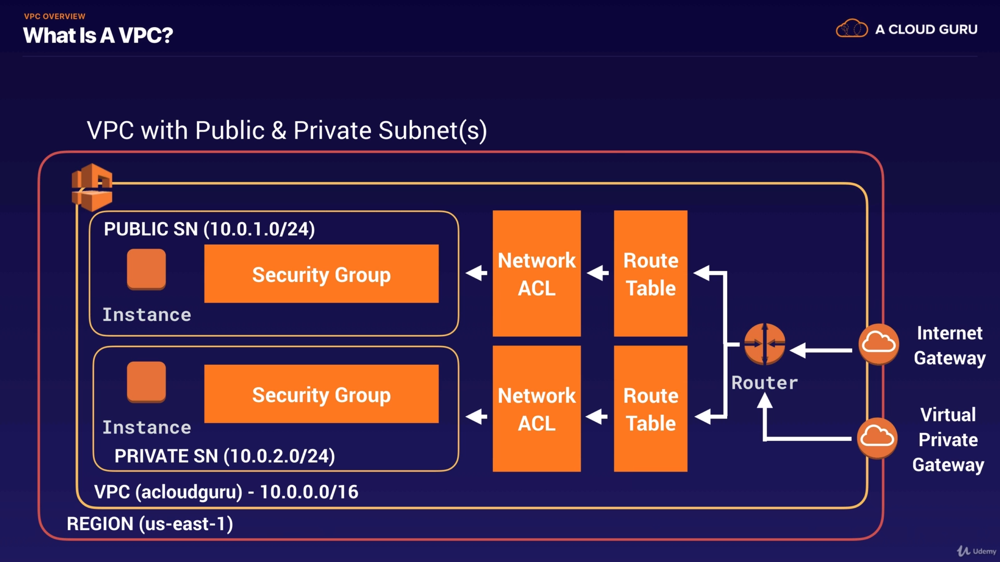
- VPC **Sizing**
  - VPC needs a set of IP addresses in the form of a Classless Inter-Domain Routing (**CIDR**) block for e.g, 10.0.0.0/16, which allows 2^16 (65536) IP address to be available
  - Allowed CIDR block size is between
    - /28 netmask (minimum with 2^4 – 16 available IP address) and
    - /16 netmask (maximum with 2^16 – 65536 IP address)
  - CIDR block from private (non-publicly routable) IP address can be assigned
    - 10.0.0.0 – 10.255.255.255 (10/8 prefix)
    - 172.16.0.0 – 172.31.255.255 (172.16/12 prefix)
    - 192.168.0.0 – 192.168.255.255 (192.168/16 prefix)
  - It’s possible to specify a range of publicly routable IP addresses; however, direct access to the Internet is not currently supported from publicly routable CIDR blocks in a VPC
  - Each VPC is separate from any other VPC created with the same CIDR block even if it resides within the same AWS account
  - By default, Amazon EC2 and Amazon VPC use the IPv4 addressing protocol
  - AWS reserves first 4 and last 1 IP address in each subnet's CIDR block
- **Subnets**
   - **1 subnet = 1 AZ** (spans a single AZ); cannot span across AZs
   - Subnet can be configured with an Internet gateway to enable communication over the Internet, or virtual private gateway (VPN) connection to enable communication with your corporate network
   - Subnet can be Public or Private and it depends on whether it has Internet connectivity i.e. is able to route traffic to the Internet through the IGW
   - Instances within the Public Subnet should be assigned a **Public** IP or **Elastic** IP address to be able to communicate with the Internet
   - For Subnets not connected to the Internet, but has traffic routed through Virtual Private Gateway only is termed as VPN-only subnet
   - Subnets can be configured to Enable assignment of the Public IP address to all the Instances launched within the Subnet by default, which can be overridden during the creation of the Instance
   - Each Subnet is associated with a route table which controls the traffic
   - By default, nondefault subnets have the IPv4 public addressing attribute set to `false`, and default subnets have this attribute set to `true`
- Security Groups are *stateful*; Network ACLs are *stateless*
- VPC **Peering**
  - A VPC peering connection is a networking connection between two VPCs that enables routing of traffic between them using private IP addresses
  - VPC peering connection can be established between your own VPCs, or with a VPC in another AWS account in same or different regions
  - VPC peering connection cannot be created between VPCs that have matching or overlapping CIDR blocks
  - NO transitive peering between VPCs
  - VPC peering does NOT support Edge to Edge Routing Through a Gateway or Private Connection
  - Only one VPC peering connection can be established between the same two VPCs at the same time
  - A placement group can span peered VPCs that are in the same region
  - Any tags created for the VPC peering connection are only applied in the account or region in which they were created
  - VPC Peering can be applied to create shared services or perform authentication with an on-premises instance
  - all resources in each VPC have access to resources in other VPC
- security groups cannot span VPCs (a security group does not show up in another)
- security groups always work at the instance level, not subnet level
- when creating a VPC, **subnet** and **IGW** are NOT created automatically; route table, NACL and security group are created by default
- **route tables**
  - Route table defines rules, termed as routes, which determine where network traffic from the subnet would be routed
  - Each VPC has a implicit router to route network traffic
  - Each VPC has a Main Route table, and can have multiple custom route tables created
  - Each Subnet within a VPC must be associated with a single route table at a time, while a route table can have multiple subnets associated with it
  - Subnet, if not explicitly associated to a route table, is implicitly associated with the main route table
  - Every route table contains a local route that enables communication within a VPC which cannot be modified or deleted
  - Route priority is decided by matching the most specific route in the route table that matches the traffic
  - Route tables needs to be updated to defined routes for Internet gateways, Virtual Private gateways, VPC Peering, VPC Endpoints, NAT Device etc.
- **IGW: Internet Gateway**
  - An Internet gateway is a horizontally scaled, redundant, and highly available VPC component that allows communication between instances in the VPC and the Internet.
  - IGW imposes no availability risks or bandwidth constraints on the network traffic.
  - only 1 IGW per VPC
  - An Internet gateway serves two purposes:
    - To provide a target in the VPC route tables for Internet-routable traffic,
    - To perform network address translation (NAT) for instances that have been NOT been assigned public IP addresses
  - Enabling Internet access to an Instance requires
    - Attaching Internet gateway to the VPC
    - Subnet should have route tables associated with the route pointing to the Internet gateway
    - Instances should have a Public IP or Elastic IP address assigned
    - Security groups and NACLs associated with the Instance should allow relevant traffic
  - E-gress only Internet Gateway
    - a horizontally scaled, redundant, and highly available VPC component
    - allows outbound communication over IPv6 from instances in your VPC to the internet
    - prevents the internet from initiating an IPv6 connection with your instances
    - for use with IPv6 traffic only; to enable outbound-only internet communication over IPv4, use a NAT gateway instead
- **DNS**
   - When you launch an EC2 instance into a **default** VPC, AWS provides it with public and private DNS hostnames that correspond to the public IPv4 and private IPv4 addresses for the instance
   - when you launch an instance into a **non-default** VPC, AWS provides the instance with a private DNS hostname only
      - New instances will only be provided with public DNS hostname depending on two DNS attributes: the DNS resolution and DNS hostnames, that you have specified for your VPC, and if your instance has a public IPv4 address
      - hence, DNS resolution and DNS hostnames need to be enabled so that your instance in a new VPC has an associated DNS hostname
   - by default, AWS DNS does not respond to requests from outside the VPC
      - The work around is to create a EC2 hosted DNS instance that does zone transfers from the internal DNS, and allows itself to be queried by external servers
- US-East-1A AZ in my AWS account is not the same as in someone else's AWS account - all randomized
- Amazon reserves 5 IP addresses within your subnets
- need a minimum of 2 public subnets to deploy an internet facing (application) load balancer
- by default, any user-created VPC subnet will not automatically assign IPv4 address to instances (except for the "default" VPC created by AWS) 
	- easiest solution is to create an Elastic IP and associate it with your instance
- Some vulnerability scans are allowed without alerting AWS; some require you to alert AWS
- by default, instances in new subnets in a custom VPC can communicate with each other across AZ
- when you create a new security group, all outbound traffic is allowed by default
- can create up to 5 VPCs in each AWS region
- in VPC, an instance does not retain its private IP
- Once a VPC is set to Dedicated hosting, it can be changed back to default hosting via the CLI, SDK or API. Note that this will not change hosting settings for existing instances, only future ones
- Deletion of the VPC is possible only after terminating all instances within the VPC, and deleting all the components with the VPC
- **Network Address Translation (NAT)**: ways to let private subnets to connect to Internet
	- needs to be associated with an Elastic IP address (or public IP address)
	- should have the **Source/Destination flag disabled** to route traffic from the instances in the private subnet to the Internet and send the response back
	- should have a Security group associated that
	  - allows Outbound Internet traffic from instances in the private subnet
	  - disallows Inbound Internet traffic from everywhere
	- Instances in the private subnet should have the Route table configured to direct all Internet traffic to the NAT device
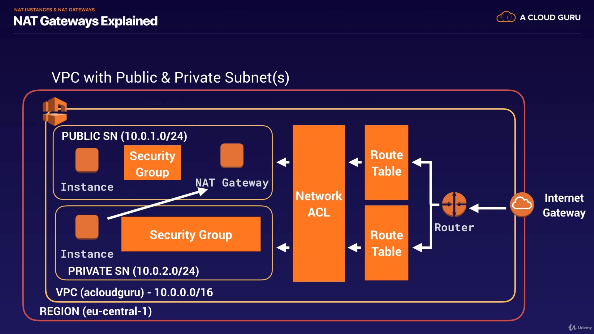
- **NAT instance**: EC2 instance
		- need to disable source/destination checks
	  - neither the source nor the destination for the traffic and merely acts as a gateway
	- must be in public subnet
	- must be a route out of the private subnet to the NAT instance
	- always behind a security group
	- can easily become a bottleneck; instance size dictates the upper limit of traffic 
	- can create high availability using auto-scaling groups, multiple subnets in different AZs, and a script to automate failover
	- can be created by using Amazon Linux AMIs
	- gradually phasing out
- **NAT gateway**: highly available gateway
	- created in specific AZ and redundant inside the AZ
	- starts at 5Gbps and scales to up to 45Gbps automatically
	- cannot be associated with security Group
	  - Security can be configured for the instances in the private subnets to control the traffic
	- no need to patch
	- automatically assigned a public IP (or Elastic IP address)
	- NAT gateway cannot send traffic over VPC endpoints, VPN connections, AWS Direct Connect, or VPC peering connections. Private subnet’s route table should be modified to route the traffic directly to these devices
	- cannot be shared across VPCs
	- 1 NAT gateway per AZ
		- if multiple AZs share one NAT gateway and if it's AZ fails, resources in other AZs lose Internet access
		- good practice to create 1 NAT gateway in each AZ
- 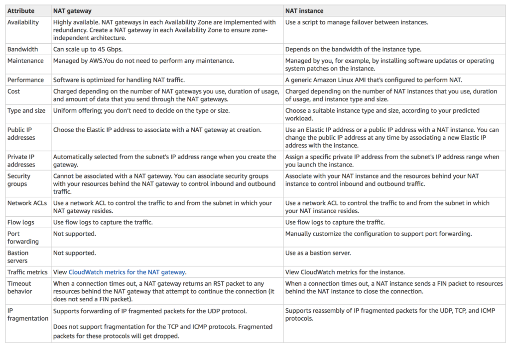
- Network ACL: Network **Access Control List**
	- default network ACL allows all outbound and inbound traffic
	- any custom network ACL denies all inbound and outbound traffic by default
	- each subnet in the VPC must be associated with a network ACL; if not specified, then default ACL
	- block IP address with network ACLs, not Security Groups
	- can associate a network ACL with multiple subnets
	  - a subnet can only be associated with one ACL at a time
	- ACL contains a numbered list of rules; rules are evaluated in numerical order
	  - if you want to deny something, always put it before the allow rule
	- always have separate inbound and outbound rules; each rule can allow or deny traffic
	- *stateless*: responses to allowed inbound traffic are subject to the rules for outbound traffic (and vice versa)
	- act first, before security groups
- VPC **Flow Logs**
	- capture information about IP traffic in/out of network interfaces
	- stored using AWS CloudWatch logs
		- need to have a CloudWatch log group in place
		- can also send to S3
	- 3 levels
		- VPC level
		- subnet level
		- Network Interface level
	- flow logs for peered VPC must be in the same account
	- can tag flow logs
	- Flow logs do not capture real-time log streams for network interfaces
	- after creation, cannot change flow log configuration (e.g. cannot change IAM role)
	- not all IP traffic is monitored, e.g.
		- traffic generated by instances when they contact Amazon DNS server (unless you use your own DNS server)
		- traffic generated by Windows instance for Amazon Windows license activation
		- traffic to and from `169.254.169.254` for instance metadata
		- DHCP traffic
		- traffic to the reserved IP address for the default VPC router
- **Bastion** Host
  - a special purpose computer on a network specifically designed and configured to withstand attacks
  - Bastion host launched in the Public subnets would act as a primary access point from the Internet and acts as a proxy to other instances
  - allows you to login to instances in the Private subnet securely without having to store the private keys on the Bastion host
  - generally hosts a single application (e.g. proxy server)
  - a NAT Gateway or NAT instance is used to provide Internet traffic to EC2 instances in a private subnet
  - The best way to implement a bastion host is to create a small EC2 instance which should only have a security group from a particular IP address for maximum security
    - This will block any SSH Brute Force attacks on your bastion host
    - It is also recommended to use a small instance rather than a large one because this host will only act as a jump server to connect to other instances in your VPC and nothing else
  - a bastion is used to securely administer EC2 instances (using SSH or RDP)
  - Deploy a Bastion host within each Availability Zone for HA, cause if the Bastion instance or the AZ hosting the Bastion server goes down the ability to connect to your private instances is lost completely
  - cannot use a NAT Gateway as a Bastion host
    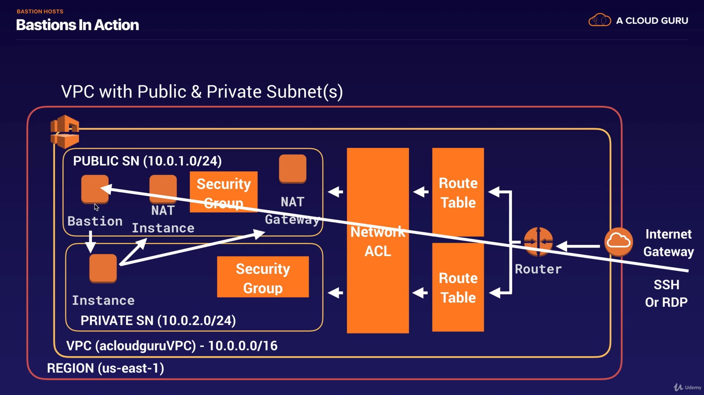
- VPC **endpoints**
	- enables you to privately connect your VPC to supported AWS services powered by Private Link
	- Instances in VPC do not require public IP addresses to communicate with resources in the service
	- traffic between VPC and the other service **does not leave the Amazon network**
	- endpoints are virtual devices that are horizontally scaled, redundant and highly available VPC components
	- cannot configure an inter-region VPC endpoint directly (use VPC peering instead)
	- VPC **endpoint policy** is an IAM resource policy attached to an endpoint for controlling access from the endpoint to the specified service
	   - You can modify the endpoint policy attached to your endpoint and add or remove the route tables used by the endpoint
	   - if you want to allow traffic to a service (e.g. S3 bucket), you need to specify the policy for the service, not the VPC itself
	- **interface endpoints**
		- an elastic network interface (ENI) with a private IP address that serves as an entry point for traffic destined to a supported service
		- enables connectivity to services powered by AWS Private Link
		- For each interface endpoint, only one subnet per Availability Zone can be selected
	- supports TCP traffic only
	- **gateway endpoints**
			- like a NAT gateway
			- a target for a specified route in the route table, used for traffic destined to a supported AWS service
		- cannot be created between a VPC and an AWS service in a different region
			- cannot be transferred from one VPC to another, or from one service to another
			- connections cannot be extended out of a VPC i.e. resources across the VPN connection, VPC peering connection, AWS Direct Connect connection cannot use the endpoint
			- support S3 and DynamoDB
			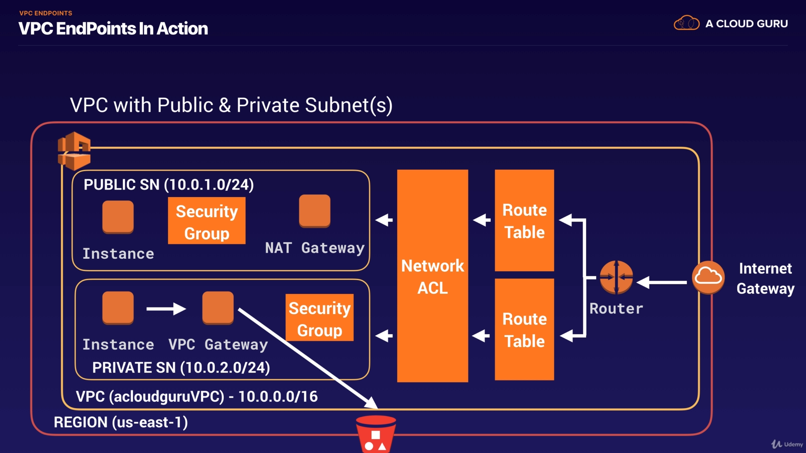
- **Private Link**
	- best way to expose a service VPC to many (e.g. thousands of) customer VPCs
	- does not require VPC peering; no route tables, NAT, IGWs, etc.
	- requires a **Network Load Balancer** on the service VPC and an **ENI** on the customer VPC
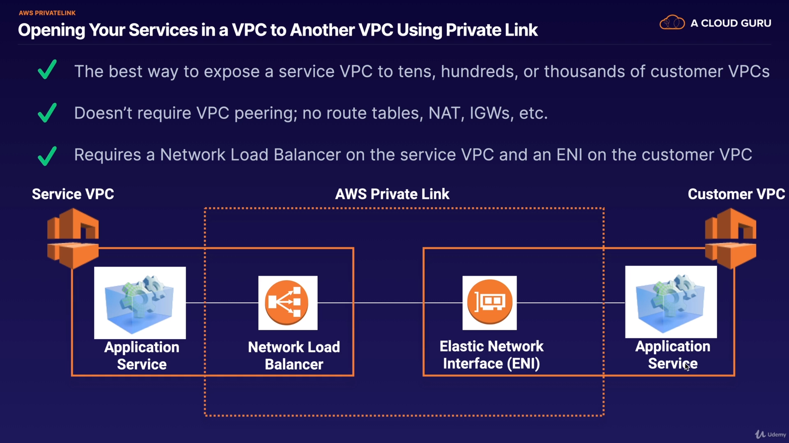
- **transit gateway**
	- a way to simplify network topology
	- allows transitive peering between many VPCs and data centers
	- works on a hub-and-spoke model
	- works on a regional basis; can have it across multiple regions
	- can use it across multiple AWS accounts using RAM (Resource Access Manager)
	- can use route tables to limit how VPCs talk to one another
	- works with Direct Connect as well as VPN connections
	- supports *IP multicast* (which is not supported by other AWS service)
		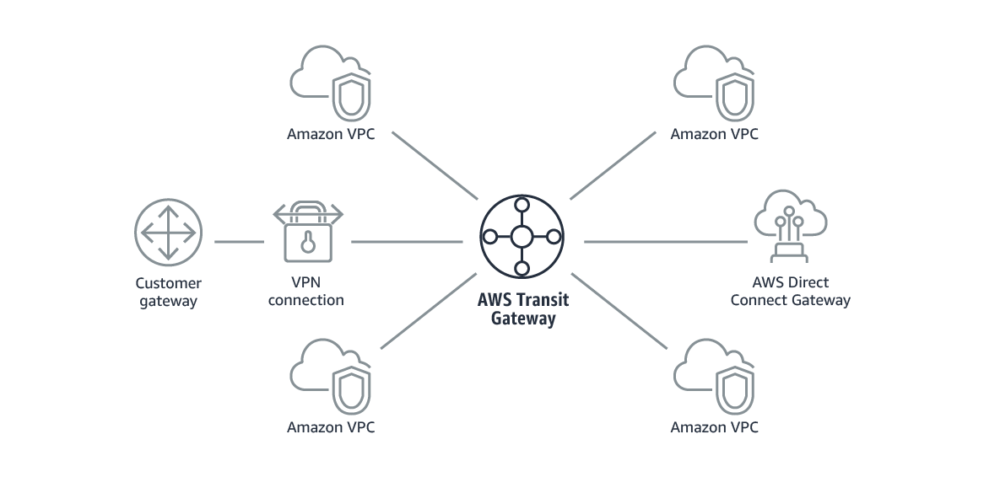
- VPC **VPN**
	- VPC VPN connections are used to extend on-premise data centers to AWS
	- VPC VPN connections provide secure IPSec connections from on-premise computers/services to AWS
	- AWS hardware VPN
	  - Connectivity can be established by creating an IPSec, hardware VPN connection between the VPC and the remote network.
	  - On the AWS side of the VPN connection, a Virtual Private Gateway (VGW) provides two VPN endpoints for automatic failover.
	  - On customer side a customer gateway (CGW) needs to be configured, which is the physical device or software application on the remote side of the VPN connection
	- AWS Direct Connect
	  - AWS Direct Connect provides a dedicated private connection from a remote network to your VPC.
	  - Direct Connect can be combined with an AWS hardware VPN connection to create an IPsec-encrypted connection
	- AWS VPN CloudHub
	  - For more than one remote network *for e.g. multiple branch offices*, multiple AWS hardware VPN connections can be created via the VPC to enable communication between these networks
	- Software VPN
	  - VPN connection can be setup by running a software VPN like OpenVPN appliance on an EC2 instance in the VPC
	  - AWS does not provide or maintain software VPN appliances; however, there are range of products provided by partners and open source communities
	  - fast and cost-effective way to establish IPSEC connectivity
	- For each VPN tunnel, AWS provides two different VPN endpoints. ECMP (Equal Cost Multi Path) can be used to carry traffic on both VPN endpoints which can increase performance
	  - ECMP must be enabled on client end device (not IGW end)
- **Site-to-site VPN**
   - two VPN tunnels between a virtual private gateway or a transit gateway on the AWS side, and a customer gateway (which represents a VPN device) on the remote (on-premises) side
   - 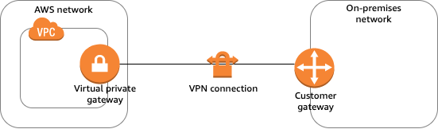
   - Virtual Private Gateway
     - the VPN concentrator on the Amazon side of the Site-to-Site VPN connection
     - When you create a virtual private gateway, you can specify the private Autonomous System Number (ASN) for the Amazon side of the gateway; otherwise created with the default ASN (64512)
     - cannot change the ASN after you've created the virtual private gateway
   - Transit Gateway
     - A transit gateway is a transit hub that you can use to interconnect your virtual private clouds (VPC) and on-premises networks
     - can replace virtual private gateway
   - Customer Gateway Device
     - a physical device or software application on your side of the Site-to-Site VPN connection
     - By default, your customer gateway device must bring up the tunnels for your Site-to-Site VPN connection by generating traffic and initiating the Internet Key Exchange (IKE) negotiation process
   - Customer Gateway
     - a resource that you create in AWS that represents the customer gateway device in your on-premises network
     - need to have a (static) public address
- VPN **CloudHub**
	- if you have multiple sites, each with its own VPN connection, you can use AWS VPN CloudHub to connect those sites together
	- only for VPN, not for VPCs
	  - not capable of many VPCs with multiple VPN connections to their data centers that span to multiple AWS Regions
	- hub-and-spoke model
	  - suitable for customers with multiple branch offices and existing
	- low cost; easy to manage
	- operates over public network, but all traffic between the customer gateway and the AWS VPN CloudHub is encrypted
	- VGW can be used to connect multiple locations; each location using existing Internet link and customer routers will set up a VPN connection to VGW
	- BGP peering will be configured between customer gateway router and VGW using unique BGP ASN at each location
	  - if BGP ASN is not unique, additional ALLOWS-IN will be required
	- VGW will receive prefixes from each location and re-advertise to other peers
- Shared VPCs
   - VPC sharing allows multiple AWS accounts to create their application resources, such as EC2 instances, RDS databases, Redshift clusters, and AWS Lambda functions, into shared, centrally-managed VPCs.
   - In this model, the account that owns the VPC (owner) shares one or more subnets with other accounts (participants) that belong to the same organization from AWS Organizations.
   - After a subnet is shared, the participants can view, create, modify, and delete their application resources in the subnets shared with them. Participants cannot view, modify, or delete resources that belong to other participants or the VPC owner.

### IP Addresses
Instances launched in the VPC can have Private, Public and Elastic IP address assigned to it and are properties of ENI (Network Interfaces)
- Private IP Addresses
  - Private IP addresses are not reachable over the Internet, and can be used for communication only between the instances within the VPC
  - All instances are assigned a private IP address, within the IP address range of the subnet, to the default network interface
  - Primary IP address is associated with the network interface for its lifetime, even when the instance is stopped and restarted and is released only when the instance is terminated
  - Additional Private IP addresses, known as secondary private IP address, can be assigned to the instances and these can be reassigned from one network interface to another
- Public IP address
  - Public IP addresses are reachable over the Internet, and can be used for communication between instances and the Internet, or with other AWS services that have public endpoints
  - Public IP address assignment to the Instance depends if the Public IP Addressing is enabled for the Subnet.
  - Public IP address can also be assigned to the Instance by enabling the Public IP addressing during the creation of the instance, which overrides the subnet’s public IP addressing attribute
  - Public IP address is assigned from AWS pool of IP addresses and it is not associated with the AWS account and hence is released when the instance is stopped and restarted or terminated.
- Elastic IP address
  - Elastic IP addresses are static, persistent public IP addresses which can be associated and disassociated with the instance, as required
  - Elastic IP address is allocated at an VPC and owned by the account unless released
  - A Network Interface can be assigned either a Public IP or an Elastic IP. If you assign an instance, already having an Public IP, an Elastic IP, the public IP is released
  - Elastic IP addresses can be moved from one instance to another, which can be within the same or different VPC within the same account
  - Elastic IP are charged for non usage i.e. if it is not associated or associated with a stopped instance or an unattached Network Interface

### Direct Connect

- a cloud service solution to establish a dedicated private network connection from your premises to AWS
	- essentially just connect your data center directly to AWS
- not traversing internet at all
- does not encrypt traffic in transit (in comparison, VPN does encrypt traffic)
- useful for high throughput workloads (i.e. a lot of network traffic) or need a stable and reliable secure connection
- A link aggregation group (LAG) is a logical interface that uses the Link Aggregation Control Protocol (LACP) to aggregate multiple connections at a single AWS Direct Connect endpoint, treating them as a single, managed connection
- see [Jayendra's blog](https://jayendrapatil.com/aws-direct-connect-dx/) for more details
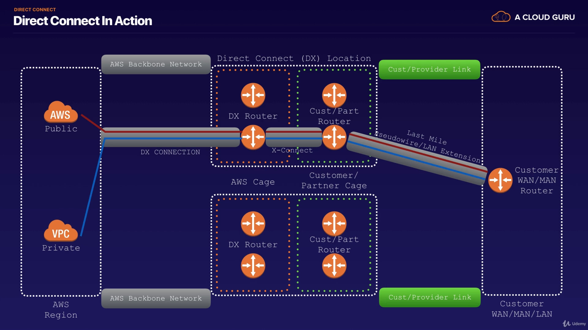
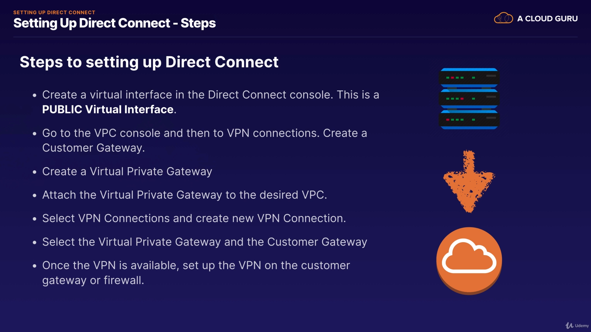


### Global Accelerator
- improve availability and performance for local and global users
  - good for use cases of gaming, media, mobile applications, and financial applications, who need very low latency
- includes following components
	- Static IP addresses
		- provides **two static IP** addresses
		- can bring your own IP address
		- requests directed to nearest healthy instance
	- Accelerator
		- directs traffic to optimal endpoints over AWS
		- includes one or more listener
	- DNS name
		- similar to `12312342abes.awsglobalaccelerator.com` - points to the static IP address that GA assigned to you
	- Network zone
		- services the static IP address for accelerator from a unique IP subnet
		- like AZ: isolated unit with its own physical infrastructure
		- by default, has two IP addresses. If one fails, can try another
	- listener
		- processes inbound connections from clients to GA
		- supports both TCP and UDP protocols
		- each listener has one or more endpoint groups associated with it
			- association by specifying the regions that you want to distribute traffic to
			- traffic is distributed to optimal endpoints within the endpoint groups associated with a listener
	- **endpoint group**
		- associated with a specific AWS region
		- includes one or more endpoints
		- can increase or reduce the percentage of traffic that would be otherwise directed to an endpoint group by adjust a setting called **traffic dial**
		- traffic dial lets you easily do performance testing or blue/green deployment testing for new releases
	- **endpoint**
		- can be network load balancer, application load balancer, EC2 instances, elastic IP address
		- can be internet-facing or internal
		- traffic is routed to endpoints based on configuration options (e.g. endpoint **weights**)

### Network costs
- use private IP addresses over public to save on costs
- if want to cut cost, group EC2 instances in the same AZ and use private IP addresses. This will be cost free, but beware of single point of failure

### ELB: Elastic Load Balancer
- 3 types of load balancer
	- **application load balancer**
		- best suited for load balancing HTTP and HTTPS traffic
		- operate at layer 7 and are application aware
		- can create advanced request routing, sending specified requests to specific web servers (by creating if-then rules)
		  - content-based, host-based, path-based routing
		- provides dynamic port mapping
	- **network load balancer**
		- best suited for load balancing of TCP traffic where extreme performance is required
		  - low latency and ability to scale
		- provides static IP address
		- operate at connection level 4
		- capable of handling millions of requests per second, while maintaining ultra-low latencies
		- supports UDP protocol (not supported by ALB)
		- can be used to terminate TLS connections
		  - to negotiate TLS connections with clients, NLB uses a security policy consisting of protocols and ciphers
	- **classic load balancer**
		- legacy elastic load balancer
		- low cost
		- can load balance HTTP(S) applications and use layer 7 specific features
		- can use strict layer 4 load balancing for applications that rely purely on the TCP protocol
- [ALB vs NLB vs CLB](https://jayendrapatil.com/aws-classic-load-balancer-vs-application-load-balancer/)
- balance traffic in **one region**, not multiple regions
- if application stops responding, the ELB responds with a **504 error**
	- means the application not responding within the idle timeout period
	- mean you need to trouble shoot the application - Web server or database server?
- if you need the IPv4 address of your end user, look for the **X-Forwarded-For** header
- no IP address for ELB; only DNS names (application and classic)
  - you can get a static IP address for network load balancer
- instances monitored by ELB are reported as `InService` or `OutofService`
- provides **access logs** that capture detailed information about requests sent to your load balancer
  - optional feature
  - each log contains information such as the time the request was received, the client's IP address, latencies, request paths, and server responses
- load balancer routes requests to the targets in a **target group**
	- you can set the targets and health checks
	- not needed for classic load balancer
- **sticky sessions** allow you to bind a user's session to a specific EC2 instance
	- ensures that all requests from the user during the session are sent to the same instance
	- e.g. online editing of a file: edits do not go to separate instances
	- can be useful if you are storing information locally to that instance
- **cross zone load balancing**
	- distribute traffic (evenly) across different AZ
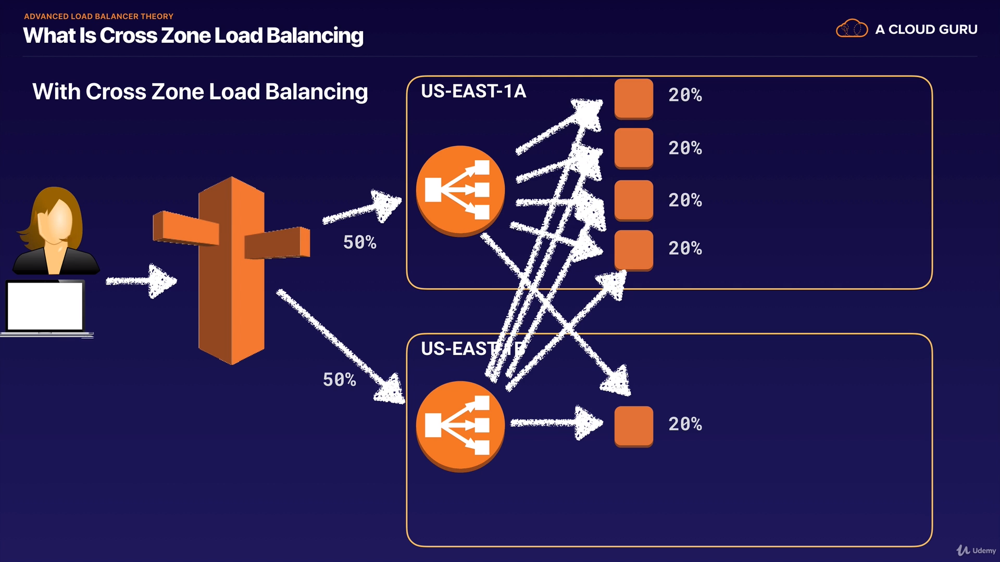
- **path patterns**: can create a listener with rules to direct traffic (forward requests) based on URL path
	- also known as path-based routing
	- e.g. route general requests to one target group and requests to render images to another target group

## Databases

### RDS: Relational Database System
- 6 RDS on AWS: SQL Server, Oracle, MySQL Server, PostgreSQL, Aurora, MariaDB
- 2 key features
	- **multi-AZ**
		- exact *synchronous* copy of production database in another AZ
		- for disaster recovery
		- fail-over is automatic
		- can force a fail-over by rebooting the RDS instance
		- not applicable to Aurora (due to its own unique fault-tolerant design)
		- cannot be promoted to be a read-replica
	- **read replicas**
		- read-only copy of the production database; can have multiple (up to 5)
		- *asynchronous* replication from the primary RDS instance to the read replica
		- subject to replication lag; might miss latest transactions
		- for performance (especially for read-intensive workload); not for disaster recovery
		- must have backups turned on to create read replicas
		- can have read replicas of read replicas
		- each read replica has its own DNS end point
		- can create read replicas of multi-AZ source databases
		- read replicas can be promoted to be their own databases. this breaks the replication
		- can have a read replica in a different region
		- not applicable to SQL Server and Oracle
- RDS is for OLTP; Red Shift is for OLAP
	- OLTP: Online Transaction Processing: e.g. order number 323245
		- prefer provisioned IOPS (instead of standard storage)
	- OLAP: Online Analytics Processing: e.g. net profit for EMEA
- RDS runs on virtual machine; you don't have access to the operating systems (cannot SSH to it)
	- patching of RDS operating system and DB is Amazon's responsibility
- RDS is not serverless (except for Aurora Serverless)
- manage DB engine configuration through the use of parameters in DB parameter group
- backups
	- **automated backup**
		- point-in-time recovery within a retention period
		- done in a scheduled window
		- once a day (24 hours)
		- capture transaction logs every 5 minutes
		- same size as your database
		- enabled by default
		- performs a *storage volume* snapshot of your DB instance
	- **database snapshot**
		- initiated manually
		- stored after DB is terminated
	- restored version (either approach) will be a new RDS instance with a new DNS endpoint
- failover
  - In Amazon RDS, failover is automatically handled so that you can resume database operations as quickly as possible without administrative intervention in the event that your primary database instance went down
  - RDS performs an automatic failover in the event of any of the following
    - Loss of availability in primary Availability Zone
    - Loss of network connectivity to primary
    - Compute unit failure on primary
    - Storage failure on primary
  - When failing over, Amazon RDS simply flips the canonical name record (CNAME) for your DB instance to point at the standby, which is in turn promoted to become the new primary
- encryption
	- encryption at rest supported by all 6 RDS services
	- use AWS Key Management Service (KMS)
	- underlying data encrypted all together (including backups, read replicas) 
	- You can only enable encryption for an Amazon RDS DB instance when you create it, not after the DB instance is created
	- you can encrypt a copy of an unencrypted DB snapshot
	- 
- authentication
  - You can authenticate to your DB instance using AWS Identity and Access Management (IAM) database authentication
    - works with MySQL and PostgreSQL
    - don't need to use a password when you connect to a DB instance; can just use authentication token
    - can create a short-lived authentication token (with `AWSAuthenticationPlugin` plugin)
- RDS instance port number is automatically applied to RDS DB security group

### DynamoDB
- one of the NoSQL databases
- fully managed
- serverless
- stored on SSD storage
- can store session state data (so does Elasticache)
- spread across 3 geographically distinct data centers
  - regional service; no need to explicitly provision multi-AZ deployment
- automatically shards data and spread across servers
- good for simple GET/PUT requests and queries
- Attribute name and value combined should not exceed 400 KB
- eventual consistent reads (default)
	- consistency across all copies reached within 1 second
- strongly consistent reads
	- returns a result that reflects all writes that received a successful response prior to the read
- DynamoDB Accelerator (DAX)
	- fully managed, highly available, in-memory cache
	- reduce request time
	- allow both read and write
- transaction: prepare/commit reads or writes for "all-or-nothing" operations (e.g. money transfer)
- table structure and performance
  - The optimal usage of a table's provisioned throughput depends not only on the workload patterns of individual items, but also on the partition-key design
  - the more distinct partition key values that your workload accesses, the more those requests will be spread across the partitioned space
  - you will use your provisioned throughput more efficiently as the ratio of partition key values accessed to the total number of partition key values increases
  - the less distinct partition key values, the less evenly spread it would be across the partitioned space, which effectively slows the performance
- on-demand capacity: 
	- pay-per-request pricing
	- no charge for read/write when idling - only storage and backups
	- higher cost per request than with provisioned capacity
- can use auto scaling
- on-demand backup and restore
	- full backups at any time
	- zero impact on table performance or availability
	- consistent within seconds and retained until deleted
	- operates within same region as the source table
- point-in-time recovery (PITR)
	- protects against accidental writes or deletes
	- restore to any point in the last 35 days
	- incremental backups
	- not enabled by default
	- latest restorable: 5 minutes in the past
- DynamoDB Stream
	- time-ordered sequence of item-level changes in a table
	- shard: a collection of stream records (data)
	- stored for 24 hours
	- integrates with Lambda to create a *trigger* that leads application to react to data modifications in DynamoDB
- global tables
	- managed multi-master, multi-region replication
	- globally distributed applications
	- based on DynamoDB streams
	- multi-region redundancy for disaster recovery
	- no application rewrites
	- replication latency under 1 second
- security
	- encryption at rest using KMS
	- site-to-site VPN
	- Direct Connect
	- IAM policies and roles
	- fine-grained access
	- CloudWatch and CloudTrail
	- VPC endpoints
- Valid header attributes
  - `host`
  - `x-amz-date`
  - `x-amz-target`
  - `content-type`

### Redshift
- fully managed data warehouse service for BI
- Configuration
	- single node (160Gb)
	- multi-node
		- leader node (manages client connections and receives queries)
		- compute node (store data and perform computations) - up to 128 compute nodes
- advanced compression
	- compress data based on column (instead of row)
	- doesn't require indexes or materialized views
- massive parallel processing (MPP)
	- automatically distrbutes data and query load across nodes
- backups
	- enabled by default with a 1-day retention period
	- max retention period is 35 days 
	- Redshift always attempts to maintain 3 copies of your data (original and replica on compute node and a backup in S3)
	- can configure Amazon Redshift to asynchronously replicate snapshots to S3 in another region for disaster recovery
	- can take manual snapshots; will remain indefinitely and won't be automatically deleted
- pricing
	- based on compute node hours: billed for 1 unit per node per hour
	- no charge for lead node
	- charge for backup; charge for data transfer within VPC
- security
	- in transit using SSL
	- at rest using AES-256 encryption
	- by default Redshift takes care of key management
		- manage your own key through HSM
		- AWS Key Management Service
- availability
	- only available in 1 AZ (no multi-AZ)
	- can restore snapshots to new AZs
- Redshift Enhanced VPC Routing provides VPC resources access to Redshift
  - no traffic through internet

### Aurora
- MySQL and PostgreSQL-compatible relational database engine
- better performance than traditional RDS and cheaper
- start with 10GB, scales in 10GB increments to 64TB (storage auto-scaling)
- compute resource up to 32vCPUs and 244GB of memory
- 2 copies of data contained in each AZ, with minimum of 3 AZ (6 copies) of data
- handles the loss of 
	- up to 2 copies of data without affecting database write availability
	- up to 3 copies of data without affecting database read availability
- self-healing: data blocks and disks are continuously scanned for errors and repaired automatically
- replica and failover
  - Failover is automatically handled by Amazon Aurora
  - If you have an Amazon Aurora Replica in the same or a different Availability Zone, when failing over, Amazon Aurora flips the canonical name record (CNAME) for your DB Instance to point at the healthy replica, which in turn is promoted to become the new primary
  - If you are running Aurora Serverless and the DB instance or AZ become unavailable, Aurora will automatically recreate the DB instance in a different AZ
  - If you do not have an Amazon Aurora Replica (i.e. single instance) and are not running Aurora Serverless, Aurora will attempt to create a new DB Instance in the same Availability Zone as the original instance
  - types of replicas
    - Aurora Replicas (15): automated failover available
    - MySQL Read Replicas (5)
    - PostgreSQL (1)
  - in-region replica only
  - automated failover with no data loss (with Aurora replicas only)
- DB instance(s)
  - When you connect to an Aurora cluster, the host name and port that you specify point to an intermediate handler called an *endpoint*
  - Using endpoints, you can map each connection to the appropriate instance or group of instances based on your use case
    - e.g. a reader endpoint and a query endpoint
  - a cluster endpoint (also known as a writer endpoint) for an Aurora DB cluster connects to the current primary DB instance for that DB cluster
- backups
  - automated backups enabled; does not impact performance
  - snapshots can be taken; no impact on performance
  - snapshots can be shared with other AWS accounts
- Amazon Aurora Global Database is designed for globally distributed applications, allowing a single Amazon Aurora database to span multiple AWS regions
- Aurora Serverless
	- on-demand, auto-scaling configuration for SQL-compatible editions of Aurora
	- automatically starts up, shuts down and scales based on needs
	- option for infrequent, intermittent, or unpredictable workloads

### ElastiCache
- a web service that makes it easy to deploy, operate, and scale an in-memory cache in the cloud
- a way to speed up database performance by caching most commonly used content
	- e.g. top 10 most popular products on a retailing site
	- faster than read-replicas
- ElastiCache is only a key-value store and cannot therefore store relational data
- Memcached vs. Redis
	- Memcached is simpler and easier to set up; Redis is more sophisticated
	- Redis is multi-AZ
	- can do backups and restores of Redis
- can store session data for your web applications and thereby provides distributed session data management
	- You can manage HTTP session data from the web servers using an In-Memory Key/Value store such as Redis and Memcached

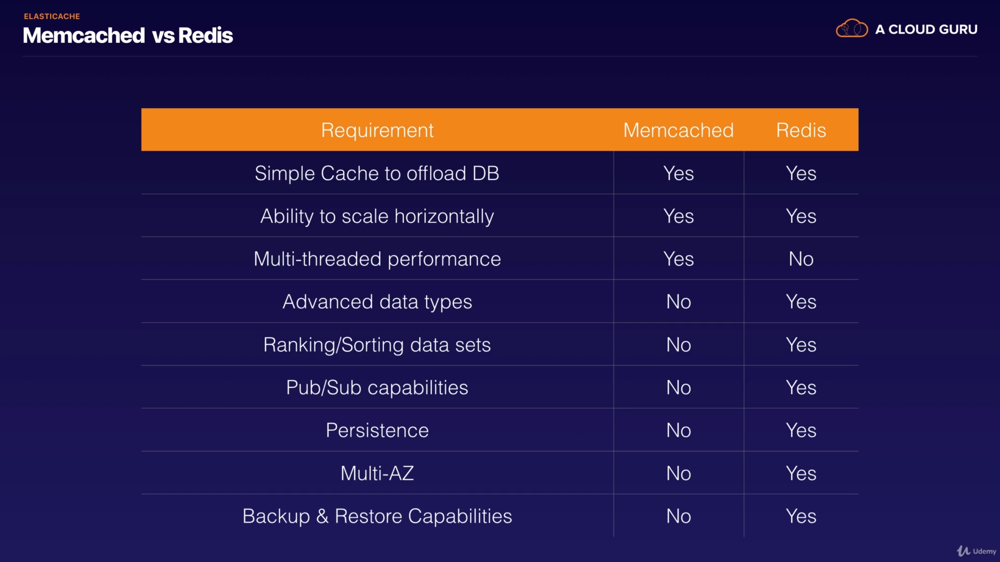

### DMS: Database Migration Service
- a cloud service to migrate databases
- essentially a server in AWS that runs replication software
- can migrate data into AWS, between on-premise instances, or between combinations of cloud and on-premise setups
- source database remains operational
- can pre-create target tables manually, or use AWS Schema Conversion Tool (SCT)
- types of migration
	- homogeneous (e.g. Oracle to Oracle) - don't need SCT
	- heterogeneous (e.g. SQL Server to Aurora) - need SCT
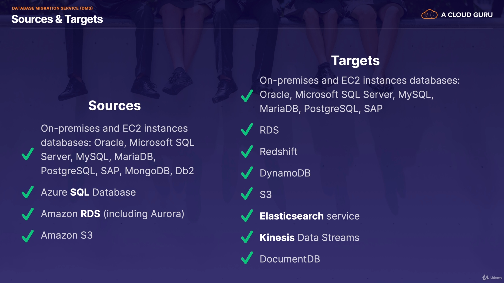

### EMR: Elastic Map Reduce
- cloud big data platform
- central component is **cluster**, a collection of EC2 instances
- each instance is a node; each node has a role, referred to as the node type
- EMR installs different software components on each node type
	- master node: every cluster must have a master node; log data is stored on master node by default
	- core node: run tasks and store data
	- task node (optional): run tasks and does not store data 
- security: periodically archive the log files on master node to S3 (in case master node is terminated)
	- must perform step when setting up the cluster; cannot do so after setup
- log analysis can be automatically provided by Amazon EMR


## Service and Applications

### CloudFormation
- a way of scripting cloud environment
  - template is stored as a text file whose format complies with the JavaScript Object Notation (JSON) or YAML standard
- uses templates and stacks to provision resources
- Quick Start has a collection of CloudFormation templates (e.g. set up a SharePoint server)
- more detailed and powerful than Elastic Beanstalk, but takes time to learn and configure
- promotes resilience as you can relaunch your instance from template
- when deploying across multiple regions, use mappings to specify the base AMI
  - AMI IDs are different across region
  - AMI IDs are difficult for users to specify; hence use parameters to control/modify AMI IDs in this case is not feasible
- CloudFormation Drift Detection
  - detect changes made to AWS resources outside the CloudFormation templates
  - only checks property values that are explicitly set by stack templates (does not determine drift for property values set by default; but you can explicit set these values, which can be numerically the same as default)
- can associate the `CreationPolicy` attribute with a resource to prevent its status from reaching create complete until AWS CloudFormation receives a specified number of success signals or the timeout period is exceeded
  - To signal a resource, you can use the `cfn-signal` helper script or SignalResource API

### CloudFormation vs. Elastic Beanstalk

- Elastic Beanstalk provides a platform to deploy resources; CloudFormation is a provisioning mechanism for a broad range of AWS resources
- Elastic Beanstalk is a platform where you deploy the applications; CloudFormation is where you define a stack of resources
- Elastic Beanstalk is good for relatively narrow use cases of PaaS applications; CloudFormation is good for broad use of defining infrastructure as code

### SQS

- a web service to give you access to a message queue
- distributed queue system that enables web service applications to quickly and reliably queue messages
- **pull-based**, not push-based
- message is 256 KB in size (can be bigger but will be saved to S3)
- messages can be kept in the queue from 1 minute to 14 days; the default retention period is 4 days
- SQS guarantees that your messages will be processed at least once
- can **decouple** the components of an application so they run independently
	- any component of a distributed application can store messages in a fail-safe queue
- a queue is a temporary repository for messages that are awaiting processing
	- acts as a buffer between the component producing and saving data, and the component receiving the data for processing
	- resolves issues that arise if the producer is faster, or if the production is only intermittent
- 2 types of queues
	- **standard queue**
		- nearly-unlimited number of transactions per second
		- guarantee a message is delivered at least once
		- provide best-effort ordering to ensure messages are generally delivered in the same order they are sent
		- may have different order and/or receiving duplicated messages
	- **FIFO queue** (first-in-first-out)
		- order is strictly preserved
		- a message is delivered only once and remains available until a consumer processes it and deletes it
		- duplicates are not introduced into the queue
		- support message groups that allow multiple ordered message groups within a single queue
		- limited to 300 transactions per second (TPS)
- queue **identifiers**
  - standard and FIFO
    - Message ID
    - Receipt Handle
  - FIFO additional
    - Message Deduplication ID: The token used for deduplication of sent messages. If a message with a particular message deduplication ID is sent successfully, any messages sent with the same message deduplication ID are accepted successfully but aren't delivered during the 5-minute deduplication interval
    - Message Group ID: The tag that specifies that a message belongs to a specific message group. Messages that belong to the same message group are always processed one by one, in a strict order relative to the message group
    - Sequence Number: The large, non-consecutive number that Amazon SQS assigns to each message
- **visibility timeout** is the amount of time that the message is invisible in the SQS queue after a reader picks up that message
	- maximum is 12 hours
	- if the job is processed before visibility timeout, the message will be deleted from the queue
	- if the job is not processed within that time, the message will become visible again and could result in a duplicated message delivery - potential cause of duplication (in exam questions)
- Amazon SQS **long polling** is a way to retrieve messages from your Amazon SQS queues
	- short polling returns immediately (even if the queue is empty)
	- doesn't return a response until a message arrives in the message queue, or the long poll times out
	- long polling is an efficient and cost-saving option if queue tends to be empty
- **dead-letter** queue
  - other queues can target this queue for messages that can't be processed (consumed) successfully
  - isolate problematic messages to determine why their processing doesn't succeed
  - useful for debugging your application or messaging system
- message-oriented API
- need to implement your own application-level tracking, especially if you have multiple queues

### AWS OpsWorks

-  a configuration management service that provides managed instances of Chef and Puppet
- Chef and Puppet are automation platforms that allow you to use code to automate the configurations of your servers
- OpsWorks lets you use Chef and Puppet to automate how servers are configured, deployed, and managed across your Amazon EC2 instances or on-premises compute environments
- 3 offerings
  - AWS Opsworks for Chef Automate
  - AWS OpsWorks for Puppet Enterprise
  - AWS OpsWorks Stacks
    - can model your application as a stack containing different layers
    - best way to establish stack-based architecture (e.g. separate stacks for dev and prod)

### AWS Step Function

- **serverless** orchestration for modern applications
- manages a workflow by breaking it into multiple steps, adding flow logic, and tracking the inputs and outputs between the steps

### SWF: Simple Workflow Service

- a web service to coordinate work across distributed application components
- enables applications of a wide range of use cases to be designed as a coordination of tasks
- **tasks** represent invocations of various processing steps in an application
	- executable code, web service calls, human actions, scripts
- combine digital environment with **human actions**
	- e.g. place an order on Amazon -> pick up product from warehouse
- workflow executions can last up to 1 year
- task-oriented API
- ensures a task assigned only once and is never duplicated
- keeps track of all the tasks and events in an application
- SWF actors
	- Workflow Starters: an application to initiate a workflow
	- Deciders: control the flow of activity tasks
	- Activity Workers: carry out the activity tasks

### SNS: Simple Notification Service
- set up, operate and send notifications
- push cloud notifications
	- to all operating systems
	- via SMS
	- by email
	- to any HTTP endpoint
- instantaneous push-based delivery
- can group multiple recipients using topics
	- a topic is an "access point" for allowing recipients
- stored redundantly across multiple AZs
- simple APIs and easy integration with applications
- inexpensive, pay-as-you-go model with no upfront cost
- web-based AWS management console offers the simplicity of a point-and-click interface
- SNS vs. SQS:
	- both are messaging service
	- SNS: **push-based**; SQS: pull/poll-based

### Elastic Transcoder
- media transcoder in the cloud
- convert media files from original source format into different formats on target device (e.g. smartphones, PCs, etc.)
- provides transcoding presets for popular output formats; don't need to guess which setting works best
- pay based on the minutes transcoded and the resolution


### API Gateway
- fully managed service for developers to publish, maintain, monitor and secure APIs at any scale
- essentially a doorway to your applications
- can do the following
	- expose **HTTPS endpoints (only)** to define a restful API
	- serverlessly connect to services like Lambda
	- send each API endpoint to a different target
	- connect to CloudWatch to log all requests for monitoring
	- maintain multiple versions of your API
- run efficiently with low cost
- scale effortlessly and automatically
- track and control usage by API key
- throttle requests to prevent attacks
- how to configure API gateway
	- define an API (container)
	- define resources and nested resources (URL paths)
	- for each resource:
		- select supported HTTP methods
		- set security
		- choose targets (e.g. EC2, Lambda, DynamoDB)
		- set request and response transformations
- deploy API to a stage
	- use API gateway domain by default
	- can use custom domain
	- now supports AWS Certificate Manager: free SSL/TLS certs
	  - AWS Certificate Manager: encrypt traffic in transit, not at rest
- control access to your Amazon API Gateway API with IAM permissions
	- To create, deploy, and manage an API in API Gateway, you must grant the API developer permissions to perform the required actions supported by the API management component of API Gateway
	- To call a deployed API or to refresh the API caching, you must grant the API caller permissions to perform required IAM actions supported by the API execution component of API Gateway
- can enable API **caching** to cache your endpoint's response
	- can reduce the number of calls made to your endpoint and improve latency of the requests
	- when enabled, API Gateway caches responses from your endpoint for a specific time-to-live (TTL) period in seconds
	- API Gateway then responds to the request by looking up the endpoint response from the cache instead of making request to endpoint
- same-origin policy
	- a web browser permits scripts contained a first web page to access data in a second web page, but only if both web pages have the same origin
	- this is done to prevent cross-site scripting (XSS) attacks
		- enforced by web browsers
		- ignored by tools like PostMan and curl
- **Cross-origin resource sharing (CORS)** is one way the server can relax the same-origin policy
	- allow restricted resources (e.g. fonts) on a web page to be requested from another domain outside the first resource's domain
	- if you see an error of "Origin policy cannot be read at the remote resource", it means you need to enable CORS on API Gateway
	- CORS is enforced by client (e.g. browser)

### AWS X-Ray

- trace and analyze user requests as they travel through your Amazon API Gateway APIs to the underlying services
- gives you an end-to-end view of an entire request, so you can analyze latencies in your APIs and their backend services
- examine Lambda (serverless) architecture

### Kinesis

- streaming data
	- data generated continuously by many data sources, typically sent in the data records simultaneously and in small sizes
	- e.g. purchases from online stores
- Kinesis is a platform to send your streaming data to
- 3 types Kinesis
	- **Kinesis Data Streams**
		- storage of 24 hours by default, up to 7 days
		- consists of **shards**
			- 5 transactions per second for reads; 
			- data read rate up to 2MB per second
			- up to 1000 records per second for writes
			- data write rate up to 1 MB per second (including partition keys)
		- data capacity of stream is a function of the number of shards -> sum of the shards' capacity
		- cannot upload data directly to Redshift (need additional applications; or use Kinesis Firehose instead)
	- **Kinesis Video Stream**
	- **Kinesis Firehose**
		- no data persistence: need to process data immediately	
		- easiest way to load streaming data into data stores and analytics tools
		- can use Amazon Kinesis Data Firehose in conjunction with Amazon Kinesis Data Streams if you need to implement real-time processing of streaming big data
		- optional: Lambda function to analyze on the fly
	- **Kinesis Analytics**
		- works with both Streams and Firehose
		- analyze data on the fly inside either Kinesis service (instead of using a Lambda function)
		- then saves data in downstream service

### On-premise service
- Database migration service (DMS)
	- allows you to move databases to and from AWS
	- supports both homogeneous and heterogeneous migration
- Server Migration Service (SMS)
	- incremental replication of your on-premise servers
	- can be used as a backup tool, multi-site strategy, and a disaster recovery tool
- AWS Application Discovery Service
	- helps enterprise to plan migration projects by gathering info about its on-premise data center
	- how it works:
		1. install AWS Application Discovery Agentless Connector as a virtual appliance on VMware
		1. it then builds a server utilization map and dependency map of the on-premise environment
		1. the collected data is retained in encrypted format; can be exported as csv file to estimate total cost of ownership (TCO)
	- this data is also available in AWS Migration Hub, where you can migrate the discovered servers and track migration progress
- VM Import/Export
	- migrate existing applications into EC2
	- can be used to create a DR strategy on AWS or use AWS as a second site
	- can use it to export your AWS VMs to your on-premise data center
- download Amazon Linux 2 as an ISO


### SAM: Serverless Application Model
- SAM: CloudFormation extension optimized for deploying serverless applications
- can define functions, APIs, tables
- supports anything CloudFormation supports
- can run serverless applications locally (in Docker)
- can package and deploy using CodeDeploy
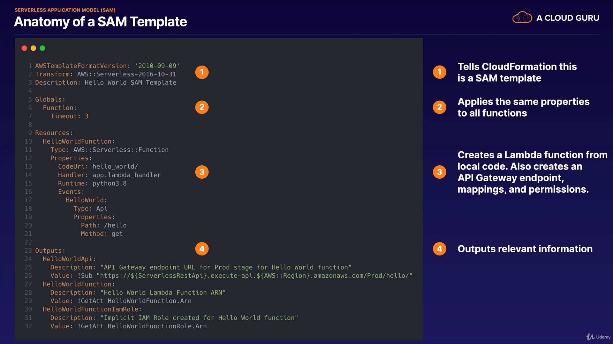

### ECS: Elastic Container Service

- a **container** is a package that contains an application, libraries, runtime and tools required to run it
- a container runs on a container engine like **docker**
- kind of like virtual machine, but different
	- provides the isolation benefits of virtualization, but with less overhead and faster starts than VMs
	- containerized applications are portable and offer a consistent environment
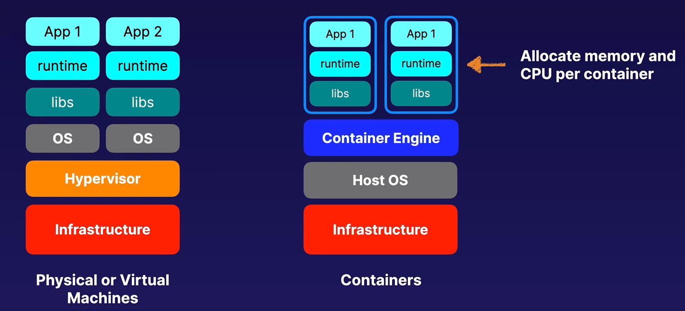
- ECS is a managed container **orchestration** service
	- can create clusters to manage fleets of container deployments
	- can manage EC2 or Fargate instances
		- Fargate: serverless container engine; eliminates needs to manage servers; each workload runs in its own kernel; works with both ECS and EKS
		- choose EC2 for compliance requirements, broader customization, GPUs
	- schedules containers for optimal placement
	- define rules for CPU and memory requirement
	- monitor resource utilization
	- deploy, update, roll back containers
	- integrates with VPC, security groups, EBS volumes, ELB
	- supports CloudTrail and CloudWatch
	- free service
- ECS components
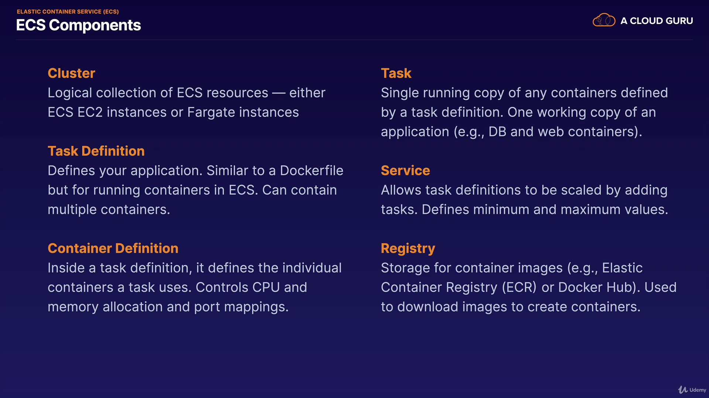
- EKS: Elastic Kubernete Service
	- provisions and scales the Kubernetes control plane, including the API servers and backend persistence layer, across multiple AWS availability zones for high availability and fault tolerance
	- portable, extensible, and open-source platform for managing containerized workloads and services
	- K8s is an open source software to deploy and manage containerized applications at scale
	- same toolset on-premises and in cloud
	- containers are grouped in pods
	- supports both EC2 and Fargate
	- use case:
		- already using K8s
		- best for cloud-agnostic and/or open-source platform
		- want to migrate to AWS
- ECR: managed docker container registry
	- store, manage, and deploy images
	- integrated with ECS and EKS
	- works with on-premises deployments
	- highly available
	- integrated with IAM
	- pay for storage and data transfer
- ECS security: task role vs. ECS instance role
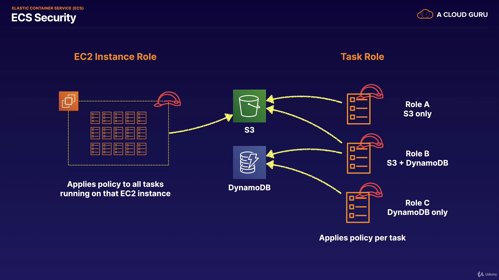

### AWS Polly

- lexicon is specific to a region
- can use SSML tags to control the speech generated (e.g. add pause between designated words)

### AWS Glue

- serverless data preparation service that makes it easy for data engineers, extract, transform, and load (ETL) developers, data analysts, and data scientists to extract, clean, enrich, normalize, and load data
- You can use AWS Glue to organize, cleanse, validate, and format data for storage in a data warehouse or data lake
- tracks data that has already been processed during a previous run of an ETL job by persisting state information from the job run. This persisted state information is called a **job bookmark**
  - Enable: Causes the job to update the state after a run to keep track of previously processed data
  - Disable: Job bookmarks are not used, and the job always processes the entire dataset
  - Pause: Process incremental data since the last successful run or the data in the range identified by the following sub-options, without updating the state of last bookmark

### AWS Trusted Advisor

- an online tool that provides you **real-time guidance to help you provision your resources following AWS best practices**
- inspects your AWS environment and makes recommendations for saving money, improving system performance and reliability, or closing security gaps
- list of checks in the following 5 categories
  - cost optimization
  - security
  - fault tolerance
  - performance
  - service limits

### CI/CD: Continuous Integration

- **CodeCommit**
  - a secure, highly scalable, managed source control service that hosts private Git repositories
- **CodeBuild**
  - You just specify the location of your source code, choose your build settings, and CodeBuild will run build scripts for compiling, testing, and packaging your code
  - AWS CodeBuild runs your builds in preconfigured build environments that contain the operating system, programming language runtime, and build tools (e.g., Apache Maven, Gradle, npm) required to complete the task
- **CodeDeploy**
  - CodeDeploy is a deployment service that automates application deployments to Amazon EC2 instances, on-premises instances, serverless Lambda functions, or Amazon ECS services
  - built with AWS SAM
    - application can be tested locally by invoking the Lambda function and event sources locally. No need to use separate CodeDeploy resource for development and production
  - 3 platforms:
    - Lambda
      - *Canary*: Traffic is shifted in two increments. You can choose from predefined canary options that specify the percentage of traffic shifted to your updated Lambda function version in the first increment and the interval, in minutes, before the remaining traffic is shifted in the second increment.
      - *Linear*: Traffic is shifted in equal increments with an equal number of minutes between each increment. You can choose from predefined linear options that specify the percentage of traffic shifted in each increment and the number of minutes between each increment.
      - *All-at-once*: All traffic is shifted from the original Lambda function to the updated Lambda function version at once.
    - ECS
    - EC2/on-premise
  - can use the following tools to monitor CodePipeline:
    - CloudWatch events
    - CloudTrail
    - Console and CLI
  - to automatically trigger pipeline based on changes in S3 bucket, use CloudWatch events rule and CloudTrail
    - should disable periodic check so that event-based trigger is enabled
    - should not use Webhook as it is for triggering pipepline when the source is Github repository
- **CodePipeline**
  - CodePipeline is a continuous delivery service that automates the building, testing, and deployment of your software into production

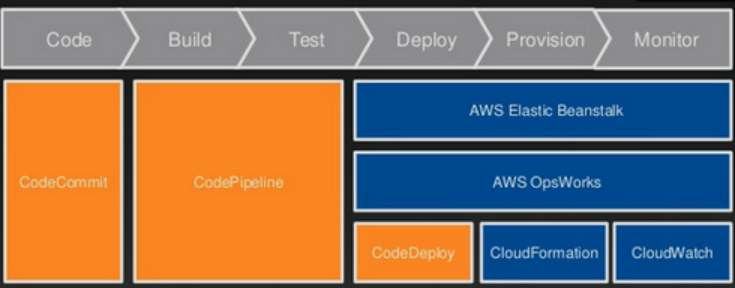

## MISC

- **RAID** (Redundant Array of Independent Disks) is just a data storage virtualization technology that combines multiple storage devices to achieve higher performance or data durability
- **Stateless** installation: the scalable components are disposable, and configuration is stored away from the disposable components
- **Blue-green** deployment: 
  - two servers are maintained: a "blue" server and a "green" server. At any given time, only one server is handling requests
  - Changes are installed on the non-live server, which is then tested through the private network to verify the changes work as expected. Once verified, the non-live server is swapped with the live server, effectively making the deployed changes live
- Common **port** numbers

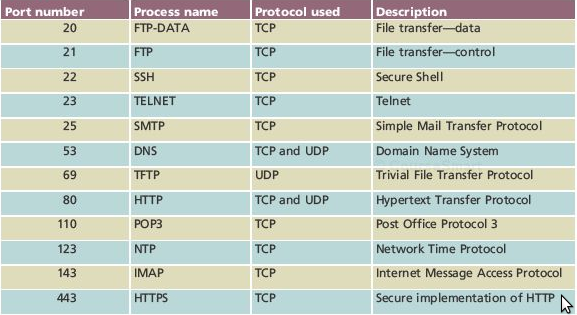


